<div class="cover" markdown="1">

<p class="title">Enterprise Knowledge Based Automation</p>

<p class="subtitle2">Complete Architecture &amp; Operations Handbook</p>

<p class="subtitle">Tumhare apne project ka hands-on training manual — code, Terraform, scripts aur AWS deployment ke hisaab se, simple Hinglish mein.</p>

<p class="meta">Repository: <code>Analyst-Parveen/Enterprise-Knowledge-Based-Automation</code><br>
Snapshot: 2026-09-12 · branch <code>aws-deployment</code> · tenant onboarding ke baad</p>

</div>

<div class="pagebreak"></div>

[TOC]

<div class="pagebreak"></div>

# 1. Is Handbook Ko Kaise Use Karein

Parveen, ye handbook tumhare **apne repository** ko padh kar likhi gayi hai — koi generic AWS ya RAG tutorial nahi. Har command, har file path, har AWS resource ka naam code, Terraform aur scripts se verify kiya gaya hai.

**Teen rules jo is handbook mein follow kiye gaye hain:**

| Rule | Matlab |
|---|---|
| Code hi source of truth hai | Agar docs aur code alag baat kehte hain, to dono likhe gaye hain aur bataya gaya hai ki code kya karta hai |
| "Implemented nahi hai" honestly likha hai | Jo cheez repo mein nahi hai, uske liye likha hai: **Project mein currently ye implemented nahi hai.** |
| Koi secret nahi | Passwords, tokens, keys, account ID — kuch nahi. Unki jagah `<YOUR_...>` placeholders hain |

**Kaise padhein:**

- Pehli baar: Chapter 2 se 5 tak seedha padh lo — project samajh aa jayega.
- Kuch karna hai (deploy, change, stop): Chapter 18–24 aur 33 (cheat sheet).
- Kuch toot gaya: Chapter 28 (troubleshooting) aur Chapter 27 (logs).
- Interview se pehle: Chapter 34.

<div class="callout info" markdown="1">
**Box ke rang ka matlab:** neela = samjhane wali baat · peela = dhyaan do · laal = ye kabhi mat karna · hara = verified fact / achhi practice.
</div>

**Is snapshot ki live state (2026-09-12):**

| Cheez | State |
|---|---|
| AWS account plan | **Paid** (Free plan CodeDeploy block karta hai) |
| Region | `us-west-2` |
| Backend stack (`envs/dev`) | Deployed — ECS + ALB + CodeDeploy blue/green |
| Database | **Amazon RDS PostgreSQL 16** (`ekba-dev-postgres`, `db.t4g.micro`, private) — Postgres sidecar ki jagah. Task replace hone par data bachta hai (2026-09-12 ko row counts se verify kiya) |
| Frontend (Amplify) | Live: `https://aws-deployment.d39pgpamq0p0n8.amplifyapp.com` |
| API front door (CloudFront) | Live: `https://d2jw2wchz5oekh.cloudfront.net` |
| Cost guard | Applied, **`DRY_RUN = true`** (report karta hai, kuch rokta nahi). Ab RDS ko **stop** bhi karta hai (delete kabhi nahi) |
| Bedrock quota | **0** — isliye AWS par chat answer aur demo seeding abhi nahi chalte |
| Roles | **Teen**: `user`, `admin`, `platform_admin` (Chapter 2.2) |
| Tenant onboarding | **Implemented** — platform operator company banata hai aur uska pehla admin invite karta hai; wo admin apne users banata hai (Chapter 7) |
| Login | **Email + password** (Cognito), pehli baar password set karna, forgot-password, silent refresh, server-side logout. Token paste karna sirf local debugging ke liye bacha hai (Chapter 6) |
| Tests | 280 backend (deploy gate 279) + 30 Playwright journeys |

<div class="callout warn" markdown="1">
Ye URLs secret nahi hain, lekin ye state badal sakti hai. `destroy.sh` ke baad backend ALB ka naam badal jata hai; CloudFront aur Amplify URL same rehte hain (Chapter 22).
</div>

<div class="pagebreak"></div>

# 2. Project Overview — Ye Project Karta Kya Hai?

## 2.1 Problem kya hai?

Ek company ke paas bahut saare documents hote hain — HR policy, travel policy, NDA template, sales deck, safety SOP, spreadsheets, diagrams, recordings. Employee ko ek chhota sa sawaal poochna ho ("hotel reimbursement limit kitni hai?") to use poora PDF dhoondhna padta hai.

Ye project ek **private company knowledge assistant** hai:

- Company apne documents upload karti hai.
- System unhe padh kar, chhote tukdon (chunks) mein tod kar, searchable bana deta hai.
- Employee natural language mein sawaal poochta hai.
- System **sirf usi company ke** documents mein se relevant hissa dhoondh kar, AI model se answer banwata hai — **source (citation) ke saath**.

## 2.2 Kaun use karta hai?

| Role | Kaun | Code mein kahan |
|---|---|---|
| `user` | Normal employee | `app/core/context.py` — `Role = "user" \| "admin" \| "platform_admin"` |
| `admin` | Us company ka admin | Same; admin endpoints `app/api/v1/admin.py` |
| `platform_admin` | **Service provider khud** — jo companies ko onboard karta hai | Same; platform endpoints `app/api/v1/platform.py` |

Sirf yahi **teen** roles hain, aur code inke alawa kuch accept nahi karta — token mein koi chautha role aaya to request 401 hoti hai, downgrade nahi.

`platform_admin` ek reserved tenant `platform` mein rehta hai. Wo tenant sirf operators rakhta hai — na documents, na conversations. Isliye tenant filtering mein koi exception banane ki zaroorat nahi padti: platform role bhi apne hi tenant se bandha hai.

**Hierarchy — kaun kya kar sakta hai:**

```text
platform_admin  (tenant "platform")
  └── company banata hai                      ──> tenant row + audit event
        └── us company ka pehla admin invite karta hai  (role=admin)
              └── admin apne users banata hai            (role=user ya admin)
```

| Role | Kar sakta hai | Kabhi nahi kar sakta |
|---|---|---|
| `platform_admin` | company banana, uska pehla admin invite karna, onboarding trail padhna | kisi bhi company ke documents, chat, ya metrics dekhna |
| `admin` | **sirf apni** company ke users banana/manage karna, `user` ya `admin` role dena, apni company ke metrics aur audit log | nayi company banana, `platform_admin` banana, doosri company ko chhoona |
| `user` | product use karna | users ya companies manage karna |

Teen cheezein is hierarchy ko todne se rokti hain:

1. **Platform role aur platform tenant ek doosre ko imply karte hain.** Token verify karte waqt hi check hota hai — `platform_admin` normal tenant mein, ya normal role `platform` tenant mein, dono reject. Aadha identity forge karna kaam nahi karta.
2. **Koi API `platform_admin` nahi de sakti.** Request schema mein hi ye value allowed nahi (422 milta hai handler chalne se pehle), aur server-side `assert_role_assignable` dobara refuse karta hai. Pehla operator `scripts/bootstrap-platform-admin.sh` se banta hai — AWS credentials wale insaan ke haath se, product ke bahar.
3. **Cross-tenant read sirf ek jagah hai, aur audited hai.** `app/db/control_plane.py` — sirf registry data (naam, id, seat counts), `PlatformAdminUser` dependency ke peeche, har mutation ka audit event.

## 2.3 Important terms — simple bhasha mein

**Multi-tenant** — Ek hi application, kai companies use karein, aur har company ka data doosri se bilkul alag rahe. "Tenant" matlab ek company. Is project mein har company ka ek `tenant_id` hota hai (jaise `seed-tenant-northwind`).

**RAG (Retrieval-Augmented Generation)** — AI model se seedha answer poochne ke bajaye, pehle apne documents mein se relevant tukde **dhoondho (retrieve)**, phir wo tukde model ko do aur kaho "sirf inke basis par answer do". Isse hallucination (banayi hui baat) kam hoti hai.

**Agentic RAG** — Ek se zyada step wala workflow jahan system khud plan karta hai, retrieve karta hai, analyze karta hai, phir answer banata hai. Ye project mein **implemented hai**: LangGraph graph `plan → retrieve → analyze → synthesize → cite` (`app/services/agents/graph.py`), 5 workflows ke saath (Chapter 13.6).

**Citations** — Answer ke saath ye batana ki ye baat kis document ke kis hisse se aayi. Model answer mein `[S1]`, `[S2]` jaise markers lagata hai; backend check karta hai ki wo marker sach mein retrieve kiye gaye chunk ka hai (`app/services/rag/guardrails.py → validate_citations`).

**Guardrails** — Suraksha ki deewarein. Input ke liye (prompt injection check), aur output ke liye (system prompt leak, secrets, unsafe HTML). Is project mein ye pipeline ke **compulsory stages** hain, optional nahi.

**Tenant isolation** — Company A ka user kabhi bhi Company B ka ek bhi document, chunk, cache entry ya answer na dekh sake. Ye is project ka **sabse important rule** hai.

## 2.4 Real-world example

```text
SERVICE PROVIDER  (tenant: platform, role: platform_admin)
   │  companies onboard karta hai, unka content kabhi nahi dekhta
   ▼
COMPANY  (tenant: seed-tenant-northwind)
   │
   ├── Department (hr, finance, legal, sales, marketing, operations, technical)
   │
   ├── Admin / User   (Cognito identity: custom:tenant_id + custom:role)
   │
   ├── Documents      (S3 mein file, PostgreSQL mein metadata)
   │
   └── Knowledge Base (Qdrant mein chunks + embeddings, har chunk par tenant_id)
          │
          ▼
   User sawaal poochta hai: "Domestic hotel reimbursement limit kya hai?"
          │
          ▼
   System SIRF northwind ke chunks mein search karta hai
          │
          ▼
   LLM (Bedrock Nova) answer banata hai
          │
          ▼
   Answer + citation: "150 USD [S1]"  →  Travel Policy 2026.pdf, page 4
```

<div class="callout ok" markdown="1">
**Verified:** ye exact example seed data mein hai — `python -m seeds.seed` "Travel Policy 2026.pdf" banata hai aur RUNBOOK ke hisaab se answer "150 USD" aata hai (local mode mein).
</div>

<div class="pagebreak"></div>

# 3. Complete Architecture

## 3.1 Poora system ek nazar mein

Neeche ke diagrams **sirf wahi components dikhate hain jo repository mein actually configure hain**. Kaunsa component live hai aur kaunsa sirf configured / blocked (jaise Bedrock quota 0), wo section 3.2 ki table mein hai.

**(A) Request path — browser se containers tak:**

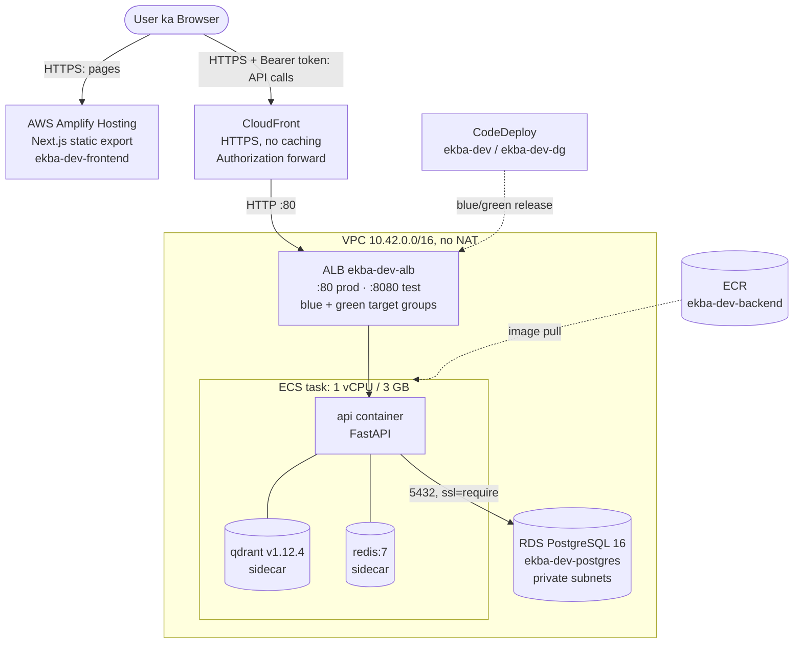

**(B) `api` container kin AWS services se baat karta hai:**

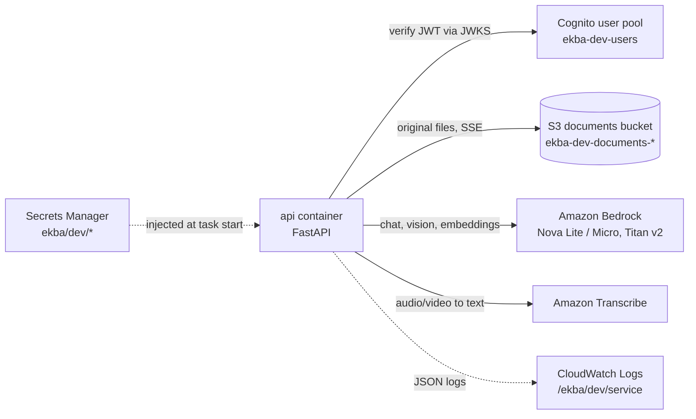

**Cost guard aur baaki control plane** (alag diagram — Chapter 30):

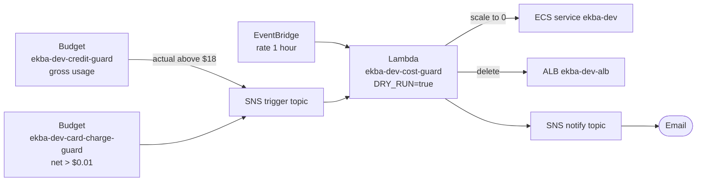

## 3.2 Kya live hai, kya nahi — honest table

| Component | Status | Detail |
|---|---|---|
| Amplify frontend | **Live** | Static export, `aws-deployment` branch se auto-build |
| CloudFront API | **Live** | HTTPS layer, ALB HTTP-only hai isliye |
| ALB + ECS Fargate | **Live** | Ek task, teen containers (api, qdrant, redis) |
| PostgreSQL | **Live (Amazon RDS)** | `ekba-dev-postgres`, `db.t4g.micro`, private subnets. Data task restart par **bachta hai**; `destroy.sh` snapshot leta hai |
| Supabase | **Implemented nahi hai** | Project mein currently ye implemented nahi hai |
| Qdrant | **Live (container)** | Sidecar, koi managed vector DB nahi |
| Redis | **Live (container)** | Sidecar. **ElastiCache nahi** |
| S3 | **Live** | Documents bucket (baseline state) |
| Cognito | **Live (code path)** | Pool + client, aur poora email/password sign-in + invitation flow implemented; AWS par live user login pending hai (Chapter 6) |
| Bedrock | **Configured, blocked** | Account quotas **0** — chat/embedding AWS par throttle hote hain |
| Transcribe | **Configured** | Audio/video ingestion ke liye; AWS par test nahi hua |
| CodeDeploy | **Live** | Blue/green deployments successful |
| CloudWatch Logs | **Live** | `/ekba/dev/service` (1 din retention) |
| CloudWatch Alarms | **Live** | `ekba-dev-5xx`, `ekba-dev-latency` |
| Cost guard (Budgets, SNS, Lambda, EventBridge) | **Live, DRY_RUN** | Report karta hai, act nahi karta |
| LangSmith | **Configured only** | Setting + secret hai, lekin tracing ka code **implemented nahi hai** |
| SQS | **Implemented nahi hai** | Project mein currently ye implemented nahi hai |
| EKS / NAT Gateway / ElastiCache / EFS | **Kabhi nahi** | Cost rule ke hisaab se Terraform mein allowed hi nahi |
| RDS Multi-AZ / bada instance / doosra database | **Kabhi nahi** | Sirf ek `db.t4g.micro` allowed hai (Chapter 11) |

<div class="pagebreak"></div>

# 4. Project Structure — Kaunsi File Kya Karti Hai?

## 4.1 Repository tree (important hisse)

```text
Enterprise-Knowledge-Based-Automation/
├── README.md, RUNBOOK.md, PROJECT.md, CLAUDE.md   ← docs + rules summary
├── amplify.yml                     ← Amplify build spec (frontend)
├── .env.example                    ← local config template (placeholders only)
├── .github/workflows/
│   ├── ci.yml                      ← tests/lint/scan on push to main/develop
│   └── deploy.yml                  ← manual AWS deploy (abhi tak run nahi hua)
├── .claude/rules/  .claude/skills/ ← project ke binding rules + workflows
├── backend/
│   ├── app/
│   │   ├── main.py                 ← FastAPI app, middleware, routes
│   │   ├── core/                   ← config, auth, context, logging, middleware, ratelimit
│   │   ├── api/deps.py             ← auth + rate-limit dependencies
│   │   ├── api/v1/                 ← health, auth, documents, chat, agents, admin, platform
│   │   ├── db/                     ← models.py, repositories.py, control_plane.py, session.py
│   │   ├── services/
│   │   │   ├── rag/                ← pipeline, cache, guardrails, prompts, rerank
│   │   │   ├── ingestion/          ← pipeline, extractors, chunker
│   │   │   ├── ai/                 ← provider (Bedrock/local), registry, transcribe
│   │   │   ├── agents/             ← LangGraph workflows
│   │   │   ├── security/           ← injection scan, file safety
│   │   │   ├── observability/      ← evaluation metrics
│   │   │   ├── identity.py         ← Cognito admin APIs + dev-local provider
│   │   │   ├── onboarding.py       ← role/tenant guard functions (pure)
│   │   │   ├── vector.py           ← Qdrant (tenant filter)
│   │   │   └── storage.py          ← S3 / MinIO
│   │   ├── schemas.py              ← Pydantic request/response models
│   │   └── workers/                ← sirf __init__.py — koi separate worker nahi
│   ├── alembic/versions/           ← 0001_initial_schema, 0002_platform_onboarding
│   ├── seeds/seed.py, documents.py, dev_token.py ← demo data + local token
│   └── tests/unit|integration|security|evaluation|e2e
├── frontend/
│   ├── next.config.mjs             ← export (Amplify) vs standalone (Docker)
│   ├── src/app/                    ← pages (dashboard, chat, documents, admin/..., platform/...)
│   ├── src/components/             ← shell, ui, charts, admin
│   ├── src/lib/api.ts              ← EK hi API client
│   ├── src/types/api.ts            ← backend response types
│   └── tests/e2e/journeys.spec.ts  ← Playwright (29 journeys)
├── infra/
│   ├── docker/                     ← docker-compose.yml, backend/frontend Dockerfiles
│   └── terraform/
│       ├── envs/baseline/          ← protected: ECR, S3, Cognito, secrets, budget, OIDC
│       ├── envs/cost-guard/        ← protected: kill switch
│       ├── envs/dev/               ← ephemeral: VPC, ALB, ECS, CodeDeploy
│       ├── envs/frontend/          ← persistent: Amplify + CloudFront
│       └── modules/network|service|cost-guard|frontend
├── scripts/                        ← lifecycle scripts (deploy, destroy, verify...)
└── docs/reports/                   ← har lifecycle run ki timestamped report
```

## 4.2 Important files — ek-ek karke

Har file ke liye: **Purpose → Kaun call karta hai → Ye kya call karti hai → Change ka asar → Kab edit karna → Kaise test karna**.

### Backend core

| File | Purpose | Called by | Calls | Edit kab? | Test kaise? |
|---|---|---|---|---|---|
| `backend/app/main.py` | FastAPI app banata hai, middleware order, 7 routers, startup par Qdrant collection ensure | uvicorn | `core/*`, `api/v1/*`, `vector.ensure_collection` | Naya router/middleware | `pytest tests/integration` |
| `backend/app/core/config.py` | **Sabhi settings ek jagah** (`Settings`), `.env` repo root se padhta hai | Har module | pydantic-settings | Naya config variable | `pytest tests/unit` + `.env.example` update |
| `backend/app/core/auth.py` | JWT verify (Cognito RS256 ya local dev HS256), tenant + role nikalna | `api/deps.py` | Cognito JWKS | Auth rules | `pytest tests/security/test_platform_security.py` |
| `backend/app/api/deps.py` | `CurrentUser`, `AdminUser`, `TenantAdminUser`, `PlatformAdminUser`, rate-limited users — har route ki "gate" | Har route | `auth.verify_token`, `ratelimit.enforce` | Naya permission type | security tests |
| `backend/app/core/middleware.py` | Correlation ID, security headers, trusted hosts, body size limit | `main.py` | — | Header/limit badalna | integration tests |
| `backend/app/core/ratelimit.py` | Redis par per-user rate limit (20/10/5 per min) + per-account auth limit (10/min) | `deps.py`, `api/v1/auth.py` | Redis | Limits | security tests |
| `backend/app/services/identity.py` | Cognito admin APIs (invite, role/status change, password reset, global sign-out) + `$0` local provider | `api/v1/auth.py`, `admin.py`, `platform.py` | boto3 `cognito-idp` | Auth ya invite flow | `pytest tests/integration/test_onboarding_api.py` |
| `backend/app/services/onboarding.py` | Guard functions — tenant id validation, role assignability, last-admin protection. Koi DB, koi I/O | `admin.py`, `platform.py` | — | Hierarchy rules | `pytest tests/security/test_onboarding_hierarchy.py` |

### Data layer

| File | Purpose | Edit kab? |
|---|---|---|
| `backend/app/db/models.py` | 10 tables ka SQLAlchemy model | Naya column/table → **saath mein Alembic migration zaroori** |
| `backend/app/db/repositories.py` | Tenant-filtered data access (documents, jobs, usage, audit, apni company ke users) | Naya query — hamesha `tenant_id` filter ke saath |
| `backend/app/db/control_plane.py` | **Ekmatra** cross-tenant surface: company registry. Sirf `PlatformAdminUser` ke peeche, sirf registry data, har mutation audited. `repositories.py` se alag rakha gaya hai taaki us file ka "sab kuch tenant-filtered hai" contract bina exception bana rahe | Sirf registry feature — yahan koi document/chat query add karna rule violation hai |
| `backend/alembic/versions/0001_initial_schema.py` | Poora schema banane wali migration | Kabhi edit mat karo agar kahin apply ho chuki; nayi migration banao |
| `backend/alembic/versions/0002_platform_onboarding.py` | `PLATFORM_ADMIN` enum label, `tenants.contact_email`, `tenants.created_by`, `users.invited_by`, reserved `platform` tenant row. Sirf additive — purana data chhua nahi jaata | Same |

### Services (business logic)

| File | Kya karti hai |
|---|---|
| `services/rag/pipeline.py` | **RAG ka dil** — 14 stage wala `answer_question` |
| `services/rag/guardrails.py` | Citation validation, output guardrail, confidence |
| `services/rag/cache.py` | Redis semantic cache (tenant-namespaced) |
| `services/rag/rerank.py` | BM25-style lexical rerank + vector score fusion |
| `services/rag/prompts.py` | System prompt (versioned in code), context envelope |
| `services/security/injection.py` | Prompt injection scanner (10 pattern families) |
| `services/security/files.py` | Upload allow-list, magic bytes, size, safe S3 key |
| `services/ingestion/pipeline.py` | Extract → chunk → scan → embed → Qdrant |
| `services/ingestion/extractors.py` | PDF, DOCX, CSV, Excel, MD, TXT, image, audio/video |
| `services/ingestion/chunker.py` | Paragraph/sentence boundary chunking with overlap |
| `services/vector.py` | Qdrant — collection, upsert, **mandatory tenant filter** search |
| `services/storage.py` | S3/MinIO — `<tenant_id>/<uuid>.<ext>` keys, presigned URLs |
| `services/ai/provider.py` | Bedrock provider + `$0` local provider |
| `services/ai/registry.py` | Model roles → model IDs, pricing, vision check |
| `services/ai/transcribe.py` | Amazon Transcribe job + polling |
| `services/agents/graph.py`, `nodes.py` | LangGraph agentic workflows |

### Frontend

| File | Purpose | Edit kab? |
|---|---|---|
| `frontend/src/lib/api.ts` | **Ekmatra** API client — token, silent refresh, correlation ID, errors | Naya endpoint call |
| `frontend/src/components/shell.tsx` | Session (email/password sign-in, first-sign-in challenge, password recovery, server-side sign-out), role-aware sidebar nav, page header | Nav item, login screen |
| `frontend/src/components/admin.tsx` | Role gates — `AdminOnly`, `TenantAdminOnly`, `PlatformAdminOnly`. Har gate backend ki exactly ek dependency ko mirror karta hai | Naya gated page |
| `frontend/src/app/platform/tenants/page.tsx` | Company onboarding wizard + registry (platform operator ke liye) | Onboarding UX |
| `frontend/src/app/admin/users/page.tsx` | Apni company ke users — invite, role/department, deactivate, password reset | User management UX |
| `frontend/src/components/ui/index.tsx` | Buttons, cards, badges, tables, stat tiles | Design system |
| `frontend/src/components/charts.tsx` | SegmentedBar, BarList, RingMeter (no library) | Chart badlav |
| `frontend/src/app/dashboard/page.tsx` | Dashboard — members/admins see knowledge; `platform_admin` lands on Control plane (registry + trail only) | Dashboard |
| `frontend/next.config.mjs` | `NEXT_OUTPUT_MODE=export` → static; warna standalone | Build mode |
| `amplify.yml` | Amplify build commands | Amplify build badalna |

### Infra & scripts

| File | Purpose |
|---|---|
| `infra/terraform/envs/*/main.tf` | Chaar Terraform states (Chapter 24) |
| `infra/terraform/modules/service/main.tf` | ALB, ECS task (3 containers), CodeDeploy, IAM, alarms |
| `infra/terraform/modules/database/main.tf` | RDS PostgreSQL, DB subnet group (write-only password) |
| `infra/terraform/modules/network/main.tf` | VPC, subnets, security groups (NO NAT) |
| `infra/terraform/modules/cost-guard/` | Budgets, SNS, Lambda (`lambda/handler.py`), EventBridge |
| `infra/terraform/modules/frontend/main.tf` | Amplify app/branch, CloudFront |
| `scripts/_common.sh` | Saare scripts ke shared guards (account check, cost guard, reports) |
| `scripts/deploy.sh` | Backend deploy pipeline |
| `scripts/deploy-frontend.sh` | Frontend deploy + wiring + verification |
| `scripts/bootstrap-platform-admin.sh` | Pehla platform operator — seedha Cognito mein. Ekmatra privileged grant jiski koi API nahi hai |
| `scripts/destroy.sh` | **Ekmatra** `terraform destroy` path |

<div class="callout warn" markdown="1">
**`backend/app/workers/` khali hai** (sirf `__init__.py`). Docs "async ingestion workers" bolte hain, lekin code mein ingestion **FastAPI `BackgroundTasks`** se usi API process ke andar chalta hai (`api/v1/documents.py → _run_ingestion_task`). Koi alag worker/queue nahi hai.
</div>

<div class="pagebreak"></div>

# 5. AWS Services — Ye Service Kya Kar Rahi Hai?

Har service ke liye: **kyun chahiye · kya store/run karti hai · input/output · kis se judi hai · console mein kahan dekhein · CLI · down ho to kya · cost · interview line.**

<div class="callout info" markdown="1">
Region hamesha **`us-west-2`**. Resource naam Terraform se hain: `ekba-<env>-<component>` (yahan `env = dev`). Account ID ki jagah `<ACCOUNT_ID>` likha hai.
</div>

## 5.1 Terraform — sab kuch banane wala

**Kaam:** AWS infrastructure ko code se create/manage karna. Console mein haath se ECS, ALB, S3 banane ke bajaye, Terraform wahi cheezein repeatable tareeke se banata hai.
**Kahan:** `infra/terraform/` — chaar alag **states** (Chapter 24).
**State kahan rehti hai:** S3 bucket `ekba-tfstate-<ACCOUNT_ID>` + lock ke liye DynamoDB table `ekba-tfstate-lock` (dono `scripts/bootstrap-state.sh` banata hai, Terraform ke bahar).
**Interview line:** "Infra ko chaar states mein baanta — protected baseline, protected cost guard, ephemeral dev, persistent frontend — taaki `destroy` kabhi secrets ya ECR images tak pahunch hi na sake."

## 5.2 S3 — original documents

| | |
|---|---|
| Kyun | Uploaded original files rakhne ke liye (sirf persistent data store) |
| Resource | `ekba-dev-documents-<random-suffix>` (baseline state) |
| Security | Public access **block**, SSE `AES256`, **versioning on**, TLS-only bucket policy, `prevent_destroy` |
| Key format | `<tenant_id>/<uuid>.<ext>` — server banata hai, filename se kabhi nahi (`services/security/files.py → build_storage_key`) |
| Input | Upload API se file bytes |
| Output | Ingestion ke liye bytes; download ke liye 300 second ka presigned URL |
| Local mein | S3 ki jagah **MinIO** container (`S3_ENDPOINT_URL=http://localhost:9000`) |

```text
Admin/User upload → POST /api/v1/documents → files.py checks → S3 put (SSE) → Document row → ingestion
```

Console: **S3 → Buckets → ekba-dev-documents-…** → folders tenant ID ke naam se.

```bash
aws s3 ls s3://<BUCKET>/                       # tenant prefixes
aws s3 ls s3://<BUCKET>/seed-tenant-northwind/ # ek tenant ki files
terraform -chdir=infra/terraform/envs/baseline output -raw s3_bucket   # bucket ka naam
```

Down ho to: upload aur download fail; baaki search chalta rahega (chunks Qdrant mein hain). Cost: pennies.

<div class="callout warn" markdown="1">
**AWS par ek important baat (2026-09-12 se badla hai):** file S3 mein bachti hai **aur** uska metadata ab **RDS PostgreSQL** mein bachta hai — task restart, naya deploy, sab ke baad. Lekin **chunks/vectors (Qdrant) abhi bhi ephemeral sidecar** mein hain, isliye task replace hone par vectors chale jaate hain: document list mein dikhega, par uska jawab RAG mein nahi aayega jab tak dobara upload na karo. Seed ke apne documents har startup par khud re-index ho jaate hain. (Re-index job project mein currently implemented nahi hai.)
</div>

## 5.3 Cognito — user identity

| | |
|---|---|
| Kyun | Login identity + JWT token dena |
| Resource | User pool `ekba-dev-users`, app client `ekba-dev-web` (baseline state) |
| Username | Email (`username_attributes = ["email"]`) |
| Custom attributes | `custom:tenant_id` (1–64 chars), `custom:role` (1–16 chars) — **saara authorization data yahi hai** |
| Password policy | Min 12 chars, upper + lower + number + symbol |
| MFA | `OFF` ("demo scope") |
| App client | Public client (**no secret**), flows: `USER_PASSWORD_AUTH`, `USER_SRP_AUTH`, `REFRESH_TOKEN_AUTH` |
| Token validity | Access 1 hour, ID 1 hour, Refresh 7 days |
| Hosted UI domain | **Configure nahi hai** — Terraform mein `aws_cognito_user_pool_domain` nahi hai, aur zaroorat bhi nahi: sign-in apna custom form hai jo `/api/v1/auth/login` se Cognito ko call karta hai |
| Custom attributes | `custom:tenant_id` (max 64), `custom:role` (max 16 — `platform_admin` 14 chars mein fit hai) |

Console: **Cognito → User pools → ekba-dev-users → Users**.

```bash
POOL=$(terraform -chdir=infra/terraform/envs/baseline output -raw cognito_user_pool_id)
aws cognito-idp list-users --user-pool-id "$POOL" --query 'Users[].[Username,UserStatus]' --output table
```

Down ho to: naye login nahi ho payenge; backend JWKS se token verify nahi kar payega → 401. Cost: is scale par free tier.

## 5.4 ECS Fargate — backend chalane wali machine

| | |
|---|---|
| Kyun | Backend container(s) chalane ke liye bina server manage kiye |
| Cluster / service | `ekba-dev` / `ekba-dev`, launch type `FARGATE`, deployment controller **`CODE_DEPLOY`** |
| Task size | 1 vCPU (`1024`) / 3 GB (`3072`), x86_64 |
| Networking | Public subnet + public IP (NAT Gateway nahi, taaki ECR/Bedrock tak pahunch sake); security group sirf ALB se traffic leta hai |
| Containers (ek hi task mein) | `api` (FastAPI), `qdrant/qdrant:v1.12.4`, `redis:7-alpine` — PostgreSQL ab RDS hai (5.17) |
| `api` startup command | `alembic upgrade head && (python -m seeds.seed \|\| echo 'seed failed …') && exec uvicorn …` |
| Health checks | api: `curl /api/v1/health`; redis: `redis-cli ping`; qdrant: koi health check nahi (isliye status UNKNOWN dikhta hai) |
| Container Insights | `disabled` (cost bachane ke liye) |

```bash
aws ecs describe-services --cluster ekba-dev --services ekba-dev \
  --query 'services[0].[desiredCount,runningCount,taskDefinition]' --output text
aws ecs list-tasks --cluster ekba-dev --desired-status RUNNING
```

Down ho to: poora API down (ALB 503/504). Cost: ~$0.054/hour (Fargate 1 vCPU/3 GB list price).

## 5.5 ECR — Docker images ka godown

| | |
|---|---|
| Repos | `ekba-dev-backend` (**use hota hai**), `ekba-dev-frontend` (bana hai, **koi push nahi karta** — frontend Amplify se deploy hota hai) |
| Tags | **IMMUTABLE** — tag = git commit SHA (7 chars), `latest` kabhi nahi |
| Scan | `scan_on_push = true`; `deploy.sh` critical findings par ruk jata hai |
| Lifecycle | Untagged 1 din mein expire; last 10 images rakho |

```bash
aws ecr describe-images --repository-name ekba-dev-backend \
  --query 'sort_by(imageDetails,&imagePushedAt)[-5:].[imageTags[0],imagePushedAt]' --output table
```

<div class="callout danger" markdown="1">
ECR images **manually delete mat karo** — CodeDeploy rollback aur redeploy unhi par depend karte hain. ECR repo `prevent_destroy` aur protected hai.
</div>

## 5.6 ALB — backend ka darwaaza

| | |
|---|---|
| Resource | `ekba-dev-alb` (internet-facing, 2 AZ), idle timeout 120 s |
| Listeners | `:80` production, `:8080` test (CodeDeploy green ko yahan check karta hai) |
| Target groups | `ekba-dev-blue`, `ekba-dev-green` — har deployment mein roles badalte hain; health check `GET /api/v1/health` → 200 |
| Security group | Sirf `allowed_cidrs` (tumhara ek `/32` IP) port 80/443 par **+** CloudFront origin-facing prefix list port 80 par. Port 8080 kisi ke liye open nahi |
| HTTPS | **Nahi** — ALB par certificate/HTTPS listener nahi hai; HTTPS CloudFront deta hai |

```bash
ALB=$(aws elbv2 describe-load-balancers --names ekba-dev-alb --query 'LoadBalancers[0].LoadBalancerArn' --output text)
aws elbv2 describe-listeners --load-balancer-arn "$ALB" --query 'Listeners[].[Port,DefaultActions[0].TargetGroupArn]' --output text
```

Down ho to: CloudFront 502/504 dega. Cost: ~$0.023/hour + LCU + 2 public IPv4.

## 5.7 CloudFront — API ka HTTPS front door

**Kyun:** Amplify site HTTPS par hai, ALB HTTP-only hai. Browser HTTPS page se HTTP API call block karta hai (mixed content), aur Amplify ka reverse proxy sirf HTTPS targets support karta hai. Isliye CloudFront (default `*.cloudfront.net` certificate) API ko HTTPS URL deta hai — **domain naam ki zaroorat nahi**.

| Setting | Value (`modules/frontend/main.tf`) |
|---|---|
| Cache policy | `ekba-dev-api-no-cache` — TTL 0 (max 1 s), **`Authorization` cache key mein** (GET par forward karne ka yahi tareeka hai; kisi aur user ko response kabhi nahi milega) |
| Origin request policy | `Managed-AllViewerExceptHostHeader` — Host ALB ka naam rehta hai, jo `TRUSTED_HOSTS` (`*.elb.amazonaws.com`) pass karta hai |
| Viewer | `https-only`, PriceClass_100 |
| Origin | ALB DNS, `http-only`, read timeout 60 s |

URL stable rehta hai; sirf origin (ALB naam) `deploy-frontend.sh` update karta hai. Cost: demo traffic par ~$0.

## 5.8 Amplify — frontend hosting

| | |
|---|---|
| App | `ekba-dev-frontend` (platform `WEB` = static hosting), repo `Analyst-Parveen/Enterprise-Knowledge-Based-Automation` |
| Branch | `aws-deployment`, stage `PRODUCTION`, framework `Next.js - SSG`, **auto-build on push** |
| Build spec | Repo ka `amplify.yml` (app root `frontend`, output `out/`) |
| Env vars (Terraform) | `AMPLIFY_MONOREPO_APP_ROOT=frontend`, `NEXT_PUBLIC_API_URL=https://<cloudfront>`, `NEXT_TELEMETRY_DISABLED=1` |
| Custom headers | HSTS, nosniff, X-Frame-Options DENY, Referrer-Policy, CSP (monorepo format `applications[].appRoot`) |
| Rule | `/<*>` → `/404.html` (404) |
| GitHub connection | AWS Amplify GitHub App (browser se ek baar authorize) — koi GitHub token Terraform state mein nahi |

Console: **Amplify → ekba-dev-frontend → aws-deployment → Deployments** (har job ke build logs).

```bash
aws amplify list-jobs --app-id <APP_ID> --branch-name aws-deployment \
  --query 'jobSummaries[].[jobId,status,commitId]' --output text
```

Cost: ~$0.04 per build (~4 build-minutes), idle ~$0.

## 5.9 CodeDeploy — blue/green release

| | |
|---|---|
| App / group | `ekba-dev` / `ekba-dev-dg`, config `CodeDeployDefault.ECSAllAtOnce` |
| Style | `BLUE_GREEN`, `WITH_TRAFFIC_CONTROL` |
| Rollback window | Purana task set 5 minute (`rollback_window_minutes`) zinda rehta hai |
| Auto rollback | `DEPLOYMENT_FAILURE` aur alarm `ekba-dev-5xx` par (configure hai, **abhi tak exercise nahi hua**) |
| Requirement | Account **Paid plan** par hona chahiye (Free plan par `SubscriptionRequiredException`) |

```bash
aws deploy list-deployments --application-name ekba-dev --deployment-group-name ekba-dev-dg --max-items 3
aws deploy get-deployment --deployment-id <DEPLOYMENT_ID> --query 'deploymentInfo.status'
```

## 5.10 Secrets Manager — secrets

Chaar containers (baseline, `recovery_window_in_days = 30`, `prevent_destroy`):
`ekba/dev/backend/database-url` (JSON: `url`, `password`), `ekba/dev/backend/qdrant-api-key`, `ekba/dev/backend/dev-auth-secret`, `ekba/dev/ai/langsmith-api-key`.
Values `scripts/set-secrets.sh` bharta hai — **Terraform state mein kabhi nahi jaate**. ECS execution role task start par inject karta hai. Cost: $0.40/secret/month ≈ $1.60/month (baseline ka sabse bada idle kharcha).

```bash
aws secretsmanager list-secrets --query "SecretList[?starts_with(Name,'ekba/dev/')].Name"   # sirf naam — value kabhi print mat karo
```

## 5.11 CloudWatch — logs aur alarms

| Log group | Retention | Kya hai |
|---|---|---|
| `/ekba/dev/service` | 1 din | ECS containers (`api`, `qdrant`, `redis` stream prefixes) |
| `/ekba/dev/audit` | 30 din | Audit logs (baseline, protected) |
| `/aws/lambda/ekba-dev-cost-guard` | 14 din | Kill-switch Lambda |

Alarms: `ekba-dev-5xx` (5 se zyada target 5xx/min, 2 minute), `ekba-dev-latency` (p95 > 10 s). Billing alarm `estimated_charges` sirf `us-east-1` mein banta — is deployment mein **exist nahi karta**; spend budgets cover karte hain.

```bash
MSYS_NO_PATHCONV=1 aws logs tail /ekba/dev/service --since 15m --follow
```

## 5.12 Bedrock — AI models

Chat primary `us.amazon.nova-lite-v1:0`, fallback `us.amazon.nova-micro-v1:0`, vision `us.amazon.nova-lite-v1:0`, embeddings `amazon.titan-embed-text-v2:0` (1024 dims). Details Chapter 14.

<div class="callout danger" markdown="1">
**Current limitation:** is account ke Bedrock quotas **0** hain (Titan Embeddings V2 requests/tokens per minute, Nova Lite cross-region requests, Nova Lite tokens/day). AWS par har Bedrock call `ThrottlingException` deta hai — isliye seed fail hota hai aur chat answer nahi deta. Fix: AWS Support case (Service limit increase → Amazon Bedrock, us-west-2).
</div>

## 5.13 Amazon Transcribe

Audio (`mp3, wav, m4a, flac, ogg`) aur video (`mp4, mov, webm`) ka transcript banata hai (`services/ai/transcribe.py`, max wait 15 min). Local mode mein bhi ye AWS call karta hai, isliye seed ka `.mp4` locally `failed` dikhta hai.

## 5.14 Lambda, SNS, EventBridge, Budgets — cost guard

Poori detail Chapter 30. Short mein: 2 budgets + hourly EventBridge rule → SNS/Lambda `ekba-dev-cost-guard` → ECS scale to 0 + ALB delete. **Abhi `DRY_RUN=true`.**

## 5.15 IAM — kaun kya kar sakta hai

| Role | Kaam |
|---|---|
| `ekba-dev-execution` | ECS task start: ECR pull, logs, **sirf project ke secrets** padhna |
| `ekba-dev-task` | App runtime: documents bucket objects, Bedrock invoke, Transcribe, aur **is project ke apne user pool par** invitation flow ke Cognito admin actions (`AdminCreateUser`, `AdminGetUser`, `AdminUpdateUserAttributes`, `AdminEnable/DisableUser`, `AdminResetUserPassword`, `AdminUserGlobalSignOut`). `AdminSetUserPassword` aur `AdminDeleteUser` **jaan-boojh kar nahi** — app kisi ka password choose nahi kar sakta, identity mita nahi sakta |
| `ekba-dev-codedeploy` | `AWSCodeDeployRoleForECS` |
| `ekba-dev-github-deploy` | GitHub Actions OIDC deploy role (scoped to this repo) |
| `ekba-dev-cost-guard` | Sirf `ecs:UpdateService` + `DeleteLoadBalancer`, woh bhi `ephemeral` tag wale `ekba-dev` resources par |
| `AmplifySSRLoggingRole-…` | Amplify console ne connect ke waqt banaya; static site ke liye use nahi hota; Terraform ignore karta hai |

## 5.16 VPC & security groups

VPC `10.42.0.0/16` — **2 public subnets** (ALB + Fargate task, public IP ke saath) aur **2 private subnets** (`10.42.10.0/24`, `10.42.11.0/24`) jinme sirf RDS hai aur koi internet route nahi. Internet gateway hai, **NAT Gateway nahi**. SGs: `ekba-dev-alb` (ingress: tumhara IP + CloudFront), `ekba-dev-tasks` (ingress: sirf ALB SG se port 8000/3000), `ekba-dev-db` (ingress: sirf tasks SG se port 5432, egress kuch nahi).

## 5.17 RDS — PostgreSQL database (managed)

1. **Kya hai:** AWS ka managed relational database. Pehle Postgres ek sidecar container tha; **2026-09-11 se ye RDS hai**.
2. **Is project mein kya karta hai:** saara relational data rakhta hai — tenants, users, documents, ingestion jobs, conversations, messages, request_usage, feedback, audit events.
3. **Naam:** `ekba-dev-postgres` · class `db.t4g.micro` · PostgreSQL 16 · 20 GB gp3 · single-AZ.
4. **Kahan rehta hai:** VPC ke **private subnets** mein (koi internet route nahi). `publicly_accessible = false`.
5. **Kaun connect kar sakta hai:** sirf backend task. SG `ekba-dev-db` port 5432 sirf `ekba-dev-tasks` SG se allow karta hai — koi CIDR nahi, koi IP nahi. Tumhara laptop seedha connect **nahi** kar sakta (yahi design hai).
6. **Password kahan se aata hai:** Secrets Manager `ekba/dev/backend/database-url` ki `password` key. Terraform use **ephemeral** resource se padh kar **write-only** `password_wo` mein deta hai → password na state mein jaata hai, na plan mein. Container ko wahi `DB_PASSWORD` milta hai aur wo khud `DATABASE_URL` banata hai (`ssl=require`).
7. **Migrations kahan chalti hain:** task ke startup par (`alembic upgrade head`). Schema already sahi ho to ye no-op hai.
8. **Data kab tak bachta hai:** task replace, naya deploy, task crash — sab mein **bachta hai**. `destroy.sh` par snapshot ban jaata hai aur agla `deploy.sh` usi se instance banata hai.
9. **Kharcha:** ~$0.016/hour instance + ~$0.003/hour storage = **~$0.019/hour**. 24/7 chale to ~$14/month — isiliye ye ephemeral stack ka hissa hai, aur cost guard ise **stop** karta hai (delete kabhi nahi).
10. **Terraform:** `infra/terraform/modules/database`, `envs/dev` se use hota hai. Encrypted at rest, backups 1 din.
11. **Dekhne ka command:**

```bash
aws rds describe-db-instances --db-instance-identifier ekba-dev-postgres \
  --query 'DBInstances[0].[DBInstanceStatus,PubliclyAccessible,StorageEncrypted]' --output text
aws rds describe-db-snapshots --db-instance-identifier ekba-dev-postgres \
  --snapshot-type manual --query 'DBSnapshots[].DBSnapshotIdentifier' --output text
```

<div class="callout warn" markdown="1">
**Dhyan do:** Qdrant aur Redis **abhi bhi ephemeral sidecars** hain. Iska matlab: tumhare upload kiye document ki row (Postgres) bach jaati hai, par uske vectors (Qdrant) task replace hone par chale jaate hain — jawab aana band ho jayega jab tak dobara upload na karo. Seed ke documents har startup par khud re-index hote hain.
</div>

## 5.18 Jo services is project mein NAHI hain

| Service | Status |
|---|---|
| Supabase | Project mein currently ye implemented nahi hai |
| Aurora / RDS Multi-AZ / RDS Proxy | Project mein currently ye implemented nahi hai — ek single-AZ `db.t4g.micro` hai |
| ElastiCache | Implemented nahi hai — Redis container |
| EKS, NAT Gateway, EFS | Rules ke hisaab se **kabhi nahi** |
| SQS | Project mein currently ye implemented nahi hai |
| Route 53 / custom domain / ACM certificate | Project mein currently ye implemented nahi hai |
| WAF | Project mein currently ye implemented nahi hai |

<div class="pagebreak"></div>

# 6. Authentication — Login Kaise Kaam Karta Hai

## 6.1 Flow — ek nazar mein

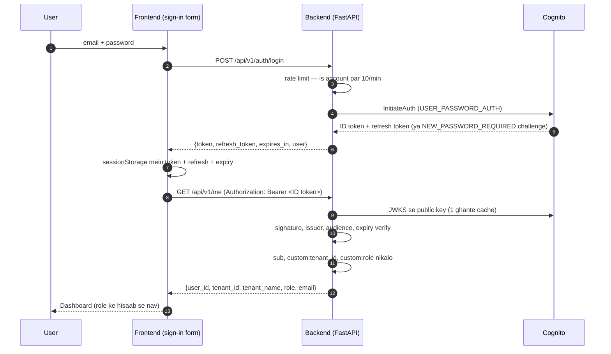

Pehli baar login karne wale invited user ke liye ek extra step hai: Cognito
`NEW_PASSWORD_REQUIRED` challenge bhejta hai, frontend "Set your password" screen
dikhata hai, aur `POST /api/v1/auth/new-password` ke baad hi session milta hai.
One-time password ek challenge credential hai, session nahi.

Password bhoolne par: `POST /api/v1/auth/forgot-password` (jo **hamesha** 202
deta hai, chahe email exist kare ya na kare — warna wo account enumeration ban
jaata) aur phir code ke saath `POST /api/v1/auth/confirm-password-reset`.

## 6.2 Basic terms

**Cognito** — AWS ki user directory. Users, passwords aur tokens sambhalti hai.
**JWT** — ek signed string (`header.payload.signature`). Payload mein claims hote hain (`sub`, `email`, `custom:tenant_id`…). Signature ki wajah se koi ise badal nahi sakta.
**ID token vs Access token** — Cognito dono deta hai. ID token mein user ke attributes (custom attributes bhi) aur `aud` (client ID) hota hai. Access token API permission ke liye hota hai aur usme custom attributes aam taur par nahi hote.

## 6.3 Frontend kya karta hai (actual code)

- Sign-in screen (`components/shell.tsx → SignIn`) mein **email + password form** hai. Chaar stages: `credentials` → `new-password` (pehli baar) / `forgot` → `reset`.
- Token `sessionStorage` mein jata hai (`lib/api.ts`), refresh token aur expiry ke saath — tab band karo to session gaya. Cookie jaan-boojh kar nahi: ye ek pure SPA hai jo alag API origin se baat karta hai, aur sessionStorage khud-ba-khud har cross-site request se bahar rehta hai.
- Har request par header: `Authorization: Bearer <ID token>` + `X-Correlation-ID`.
- **Silent refresh hai.** Token expire hone se 2 minute pehle hi `POST /api/v1/auth/refresh` chal jaata hai, aur 401 aane par ek baar retry hota hai. Ek hi in-flight refresh promise share hota hai, warna 10 parallel requests 10 refresh trigger kar deti.
- Sign-out pehle server par `POST /api/v1/auth/logout` maarta hai (Cognito global sign-out — saare live tokens revoke), phir local session clear karta hai. Sirf local clear karna "logout jaisa lagta hai" hota, logout nahi.
- Refresh bhi fail ho jaye to token delete (`clearToken`) → wapas sign-in screen.
- **"Developer sign-in"** disclosure mein wahi purana token box hai, lekin wo sirf tab render hota hai jab API localhost ho — deployed build mein wo box hota hi nahi.

## 6.4 Backend kya karta hai (`core/auth.py`)

1. `api/deps.py → current_context` Bearer token nikalta hai; nahi hai to **401 "Authentication required."**
2. **Local dev mode** (`ENVIRONMENT=dev` **aur** `DEV_AUTH_ENABLED=true`): token HS256 se `DEV_AUTH_SECRET` ke saath verify (`seeds/dev_token.py` banata hai). Dono conditions na hon to ye path band.
3. **AWS mode**: Cognito JWKS (`https://cognito-idp.us-west-2.amazonaws.com/<POOL_ID>/.well-known/jwks.json`) se key lekar **RS256** verify: signature, `exp`, `iss`, aur `aud = COGNITO_CLIENT_ID`.
4. Claims → `RequestContext`:
   - `user_id` = `sub`
   - `tenant_id` = `custom:tenant_id` (ya `tenant_id`) — **nahi mila to 401** ("Token is missing a tenant assignment.")
   - `role` = `custom:role` (default `user`); `user`/`admin`/`platform_admin` ke alawa kuch bhi → 401
5. **Platform role aur platform tenant ka mutual binding:** agar `role == "platform_admin"` hai lekin tenant `platform` nahi (ya ulta), to 401 + critical security event. Isliye platform identity ka aadha hissa forge karke kuch nahi milta.
6. Ye context poori request mein use hota hai — koi route khud token parse nahi karta.

**Errors ka matlab:**

| Situation | Response | Security event |
|---|---|---|
| Token nahi bheja | 401 `Authentication required.` | — |
| Bekaar/galat token | 401 `Invalid token.` | `auth.invalid_token` |
| Expired | 401 `Token has expired.` | `auth.token_expired` |
| Galat issuer/audience | 401 `Invalid token.` | `auth.bad_issuer` / `auth.bad_audience` |
| Tenant claim missing | 401 | `auth.missing_tenant` |
| `platform_admin` normal tenant mein (ya ulta) | 401 `Token carries an inconsistent tenant assignment.` | `auth.platform_role_tenant_mismatch` (critical) |
| Admin route par non-admin | 403 | `authz.admin_required` |
| Platform route par tenant role | 403 | `authz.platform_required` |
| Galat email/password | 401 `Incorrect email or password.` — dono cases mein **ek hi** message | `auth.signin_failed` |
| Ek account par 10+ sign-in attempts/min | 429 `Retry-After` ke saath | rate-limit event |

## 6.5 Tenant aur role kahan se aate hain

**Sirf verified token se.** Request body, query ya header mein `tenant_id` bhejne se kuch nahi hota — `ChatRequest` mein `tenant_id` field hai hi nahi (`schemas.py`: "deliberately no tenant_id field").

## 6.6 ID token vs Access token — kyun ID token

Ye ek interview-favourite detail hai, aur ab isse manually deal karne ki zaroorat nahi — auth endpoints seedha ID token return karte hain.

Wajah: `core/auth.py` `custom:tenant_id` claim maangta hai aur `aud` ko client ID se verify karta hai. Cognito ke standard tokens mein **ye dono ID token mein hote hain**:

| | ID token | Access token |
|---|---|---|
| `custom:tenant_id`, `custom:role` | ✅ | ❌ |
| `aud` (client ID) | ✅ | ❌ (`client_id` hota hai, `aud` nahi) |

Matlab access token audience verification par hi fail ho jaata. Agar kabhi "Token is missing a tenant assignment" dikhe, to 90% chance hai ki access token use ho raha hai.

CLI se debug karna ho to:

```bash
aws cognito-idp initiate-auth --client-id "$CLIENT" --auth-flow USER_PASSWORD_AUTH \
  --auth-parameters USERNAME=<EMAIL>,PASSWORD='<PASSWORD>' \
  --query 'AuthenticationResult.IdToken' --output text
```

## 6.7 Password kabhi app ke paas nahi aata

Ye ek design decision hai, shortcut nahi:

- App password **set, store, read, log ya return** kabhi nahi karta. Kisi bhi API response mein password field nahi hai.
- Naye accounts sirf invitation se bante hain: Cognito khud one-time password generate karke email karta hai, aur invitee pehle sign-in par apna password set karta hai. Share karne layak koi cheez exist hi nahi karti.
- ECS task role ke paas `AdminSetUserPassword` aur `AdminDeleteUser` **jaan-boojh kar nahi** hain — application kisi ka password choose nahi kar sakta, aur identity mita nahi sakta.
- User deactivate karne par live tokens turant revoke hote hain (`AdminUserGlobalSignOut`), expire hone ka intezaar nahi.

## 6.8 Token expiry

| Mode | Validity |
|---|---|
| Local `dev_token` | Default 12 ghante (`--hours`) |
| Cognito ID token | 1 ghanta (app client config) |
| Refresh token | 7 din — frontend ise **use karta hai**, expiry se 2 min pehle silently renew |

<div class="pagebreak"></div>

# 7. Company / Tenant / User Creation

## 7.1 Seedhi baat pehle

Company onboarding ek **product feature** hai, CLI ritual nahi. Teen level hain, aur har level sirf apne se ek neeche wale ko bana sakta hai:

```text
platform_admin  ──creates──>  Company (tenant)
                              └──invites──>  admin (us company ka)
                                             └──creates──>  user / admin (usi company mein)
```

Sideways ya upar ki taraf kuch nahi hota: ek company ka admin na nayi company bana sakta, na platform operator, na doosri company ko chhoo sakta.

## 7.2 Tenant ID kahan "rehta" hai?

Do jagah, aur dono ka kaam alag hai:

- **Cognito attribute `custom:tenant_id`** — ye **authorization** ka source hai. Token se padha jaata hai, aur sirf yahi count hota hai. Body/query/header mein `tenant_id` bhejne se kuch nahi hota.
- **`tenants` table (PostgreSQL/RDS)** — ye company ka **record** hai: naam, contact, kisne banaya, kab. Registry yahan hai, permission nahi.

Ye jaan-boojh kar alag hain. Token compromise ho jaye to DB row usse rok nahi sakti, aur DB down ho jaye to authorization tootna nahi chahiye. Isliye tenant ka naam dikhane wala lookup `/me` mein try/except ke andar hai — DB ka blip ek valid session ko invalid nahi banata.

Tenant ID **permanent** hai: wo S3 prefix, Qdrant retrieval filter aur cache namespace ban jaata hai, isliye baad mein badla nahi ja sakta.

## 7.3 Example: "ABC Insurance" ko onboard karna

### Step 0 — Pehla platform operator (ek hi baar, poore system mein)

Ye ekmatra privileged grant hai jiski koi API nahi hai — jaan-boojh kar. Jo API platform operator bana sakti, wo product ka sabse qeemati target hoti.

```bash
./scripts/bootstrap-platform-admin.sh --dry-run --email ops@yourcompany.com
./scripts/bootstrap-platform-admin.sh --email ops@yourcompany.com --name "Platform Operator"
```

Script pehle account, region aur pool ka ownership verify karta hai (naam `ekba-dev-*` **aur** tag `ProjectCode=ekba`), phir Cognito user banata hai `custom:role=platform_admin` + `custom:tenant_id=platform` ke saath. Password wo set nahi karta — Cognito khud one-time password email karta hai. Dubara chalane par kuch nahi todta.

### Step 1 — Company banao (UI se, 30 second)

Platform operator se login karo → **Companies** → **Onboard a company**:

- Naam: `ABC Insurance Private Limited`
- Tenant id: naam se slug apne-aap ban jaata hai (`abc-insurance-private-limited`), aur edit bhi kar sakte ho
- Contact email: optional, sirf record ke liye — ye login **nahi** hai

Reserved ids (`platform`, `admin`, `api`, `root`, `system`…) aur duplicate ids refuse hote hain.

### Step 2 — Uska pehla admin invite karo

Usi screen par step 2: email, naam, department. Role **select karne ko nahi milta** — ye screen sirf ek hi kism ka account banati hai (`admin`), taaki galti se platform operator na ban jaye.

Cognito us admin ko one-time password email karta hai. **Tum wo password kabhi nahi dekhte.**

### Step 3 — Admin apne users banata hai

Wo admin login karta hai (pehle sign-in par apna password set karta hai), phir **Users** → **Invite a user**: email, naam, role (`user` ya `admin` — bas), department. Har invite par Cognito phir se one-time password email karta hai.

### Step 4 — Isolation apne aap ho jaata hai

ABC ka har upload `abc-insurance.../<uuid>` S3 key, us tenant id ke DB rows, aur us tenant id ke Qdrant points par jaata hai. Northwind ka user — ya Northwind ka **admin** — ise kabhi nahi dekh sakta. Jo platform operator ne ABC banayi, wo bhi ABC ke documents nahi khol sakta.

### Role badalna

Company ke apne **Users** page se: role dropdown badlo. Backend Cognito mein mirror karta hai aur `user.role_changed` audit event likhta hai — actor ke saath. CLI se bhi ho sakta hai, lekin phir audit trail nahi banta, isliye UI better hai.

```bash
# CLI sirf inspection/repair ke liye
aws cognito-idp admin-update-user-attributes --user-pool-id "$POOL" \
  --username user@abc-insurance.example --user-attributes Name=custom:role,Value=admin
```

Naya role **agle login** (naye token) se lagta hai.

<div class="callout danger" markdown="1">
`custom:tenant_id` **galat likhna = galat company ka data access**. UI se banaye gaye users mein ye risk nahi hai (tenant token se aata hai, form se nahi) — lekin CLI se user banate waqt poori savdhani. Tenant ID ek baar set ho gaya to use mat badlo, aur ek identity ek hi tenant mein honi chahiye.
</div>

## 7.4 Local mein users (no Cognito)

`seeds/seed.py` ye banata hai:

| user_id | Tenant | Role | Email |
|---|---|---|---|
| `seed-platform-admin` | `platform` | platform_admin | `platform@ekba.example` |
| `seed-user-a` | `seed-tenant-northwind` | user | `priya@northwind.example` |
| `seed-admin-a` | `seed-tenant-northwind` | admin | `admin@northwind.example` |
| `seed-user-b` | `seed-tenant-contoso` | user | `jordan@contoso.example` |
| `seed-admin-b` | `seed-tenant-contoso` | admin | `admin@contoso.example` |

Login: inme se koi bhi email + `.env` ka `DEV_AUTH_PASSWORD` (default `LocalDev!2026`). Yahi wahi email/password screen hai jo AWS par chalti hai — local mein `LocalIdentityProvider` HS256 token mint karta hai, AWS par Cognito RS256 deta hai, aur **application code ek hi rehta hai**.

Token seedha chahiye ho to:

```bash
cd backend
python -m seeds.dev_token                                    # northwind user
python -m seeds.dev_token --role admin --user seed-admin-a   # northwind admin
python -m seeds.dev_token --role platform_admin              # platform operator
python -m seeds.dev_token --tenant seed-tenant-contoso --user seed-admin-b --role admin
```

Isse "Developer sign-in" disclosure mein paste karo (sirf localhost par dikhta hai).

Documents sirf northwind mein seed hote hain — contoso admin se login karke tenant isolation demo dikhta hai (documents khali, users list mein sirf contoso ke log, chat "not found").

<div class="pagebreak"></div>

# 8. Admin vs User

## 8.1 Kaun kya kar sakta hai (code ke hisaab se)

| Capability | USER | ADMIN | PLATFORM_ADMIN | Code |
|---|---|---|---|---|
| Apne tenant ke documents dekhna (list/detail/status) | ✅ | ✅ | ❌ — platform tenant mein documents hi nahi | `documents.py` (rate-limited) |
| Document **upload** | ✅ | ✅ | ❌ | `POST /documents` — `UploadUser` (admin-only **nahi**) |
| Document **download** (presigned URL, 5 min) | ✅ | ✅ | ❌ | `GET /documents/{id}/download` |
| Document **delete** | ✅ sirf apna (owner) | ✅ tenant ka koi bhi | ❌ | `repositories.soft_delete_document` |
| Knowledge chat (RAG) | ✅ | ✅ | ❌ | `POST /chat` |
| Agentic workflows | ✅ | ✅ | ❌ | `/agents/*` (10/min) |
| Feedback | ✅ | ✅ | ❌ | `POST /feedback` |
| AI metrics (`/admin/metrics`) | ❌ 403 | ✅ apne tenant ka | ❌ | `admin.py` |
| Audit log (`/admin/audit`) | ❌ | ✅ apne tenant ka | ❌ | `admin.py` |
| Security events (`/admin/security`) | ❌ | ✅ | ✅ | `admin.py` |
| Apni company ka record (`/admin/tenant`) | ❌ | ✅ | ❌ | `admin.py` |
| **Apni company ke users** — list, invite, role/department, deactivate, password reset | ❌ | ✅ | ❌ — operator company ki directory se bahar rehta hai | `admin.py` + `TenantAdminUser` |
| **Nayi company banana** (`POST /platform/tenants`) | ❌ | ❌ **403** | ✅ | `platform.py` + `PlatformAdminUser` |
| **Company ka pehla admin invite karna** | ❌ | ❌ | ✅ | `platform.py` |
| Company registry dekhna (naam, id, seat counts) | ❌ | ❌ | ✅ | `db/control_plane.py` |
| Onboarding trail (`/platform/audit`) | ❌ | ❌ | ✅ — sirf `tenant.*`/`user.*`/`platform.*` events | `platform.py` |
| `platform_admin` role kisi ko dena | ❌ | ❌ — **schema hi reject karta hai (422)**, aur server dobara | ❌ — iski bhi koi API nahi | `onboarding.assert_role_assignable` |
| Doosre tenant ka data | ❌ | ❌ — **admin bhi nahi** | ❌ — **operator bhi nahi** | `tenant-isolation.md` |

<div class="callout info" markdown="1">
**Admin ≠ super-user.** Admin ko sirf apne tenant ka operational data milta hai. Frontend button chhupana authorization nahi hai — API khud check karta hai (`AdminUser` / `TenantAdminUser` / `PlatformAdminUser` dependency). Frontend ke teen gates (`AdminOnly`, `TenantAdminOnly`, `PlatformAdminOnly`) exactly inhi teen dependencies ko mirror karte hain, taaki UI aur API kabhi disagree na karein.
</div>

<div class="callout warn" markdown="1">
**Platform operator ≠ super-user bhi.** Company onboard karna us company ki chaabi nahi hai. Operator registry dekh sakta hai, content nahi — aur ye rule ka hissa hai, implementation detail nahi.
</div>

## 8.2 Limits (teeno roles par)

| Limit | Value | Kahan |
|---|---|---|
| API requests | 20 / minute / user | Redis `ekba:rl:api:<tenant>:<user>` |
| Agent (server) requests | 10 / minute | `ekba:rl:server:…` |
| Uploads | 5 / minute (+ API bucket) | `ekba:rl:upload:…` |
| **Sign-in / password reset** | 10 / minute / **account** | `ekba:rl:auth:<sha256 of account>` |
| Upload size | 50 MB | `S3_UPLOAD_MAX_BYTES` |
| Daily AI spend | $0.50 / user / din | `DAILY_COST_CEILING_USD` (`request_usage` table se) |

Auth limit IP par **nahi**, account par hai — CloudFront + ALB ke peeche client IP ya to bahut logon mein shared hoti hai ya client khud bhejta hai, to IP-based limit galat logon ko rokti hai aur asli attacker ke liye bekaar hai. Account identifier Redis tak pahunchne se pehle hash ho jaata hai, isliye kisi key mein email nahi hoti.

## 8.3 Scenario

```text
Admin (northwind) login → Documents page → "Leave and Absence Policy.pdf" upload (dept: hr)
   → 201: document status "pending", job "queued"
   → background: extracting → chunking → embedding → ready
User (northwind) login → Knowledge Chat → "How much annual leave carries over?"
   → answer "5 days [S1]" + citation → Leave and Absence Policy.pdf
```

<div class="pagebreak"></div>

# 9. Frontend — Browser Mein Kya Chal Raha Hai

## 9.1 Tech stack (`frontend/package.json`)

Next.js **15.1.3** (App Router) · React 19 · TypeScript (strict) · Tailwind CSS 3.4 · `lucide-react` icons · koi chart library nahi (apne SVG/CSS charts).

## 9.2 Do build modes

| Mode | Kab | Setting | Output |
|---|---|---|---|
| **Static export** | AWS Amplify | `NEXT_OUTPUT_MODE=export` (`amplify.yml` set karta hai) | `frontend/out/` — har page ki HTML file (`chat.html`, …) |
| **Standalone server** | Docker image (`infra/docker/frontend.Dockerfile`) | default | `.next/standalone/server.js` |

`next.config.mjs` export mode mein `headers()` nahi deta — static site header nahi bhej sakti, isliye security headers **Amplify** set karta hai.

## 9.3 Pages (routes)

| Route | Kaun | Kya dikhata hai |
|---|---|---|
| `/` | — | `/dashboard` par redirect |
| `/dashboard` | sab | Hero, API status, KPI cards, ingestion/content/department charts, recent documents, admin ke liye AI operations |
| `/chat` | sab | Knowledge chat — answer, citations, confidence, model, tokens, cost, latency |
| `/agents` | sab | Workflows (5 types) chalana |
| `/documents` | sab | Upload, list, filter, delete |
| `/departments` | sab | Department-wise documents |
| `/usage` | sab (data admin ko) | Usage stats |
| `/feedback` | sab | Feedback form |
| `/admin/users` | admin (tenant admin only) | **Apni company ke users** — invite, role/department, deactivate/reactivate, password reset |
| `/admin/tenants` | admin | "My Company" — company record + seats + documents/chunks |
| `/admin/documents` | admin | Read-only document list |
| `/admin/metrics` | admin | AI metrics |
| `/admin/security`, `/admin/audit` | admin | Events |
| `/admin/deployments` | admin | Blue/green explanation + API health |
| `/platform/tenants` | platform_admin | **Companies** — onboarding wizard (company → pehla admin) + registry, suspend/reactivate |
| `/platform/audit` | platform_admin | Onboarding trail — saari companies ke lifecycle events |

Nav **role-aware** hai: platform operator ko control plane dikhta hai aur chat/documents **nahi** — kyunki platform tenant mein content hi nahi hai. Ye chhupana security nahi hai; har route server par dobara authorize hota hai.

Saare pages `"use client"` hain — data browser se API call karke aata hai. Server-side data fetching **nahi hai**, isliye static export sambhav hai.

## 9.4 API client — `src/lib/api.ts`

```text
BASE_URL = process.env.NEXT_PUBLIC_API_URL ?? "http://localhost:8000"
request(path) → expiry 2 min door hai? → pehle silently refresh
            → headers: X-Correlation-ID (naya har request), Authorization: Bearer <ID token>
            → fetch(BASE_URL + path)
            → network fail: "Could not reach the API. Is the backend running?"
            → 401: ek baar refresh + retry; phir bhi 401 → token clear
```

`rawRequest` (refresh logic ke bina) aur `request` (refresh ke saath) alag hain — warna refresh call khud refresh trigger karke infinite loop bana deta. FormData body wali request retry nahi hoti, kyunki stream dobara padhi nahi ja sakti.

**`NEXT_PUBLIC_API_URL`:**

| Environment | Value | Kaun set karta hai |
|---|---|---|
| Local | unset → `http://localhost:8000` | default |
| AWS Amplify | `https://<cloudfront-domain>` | Terraform (Amplify env var) |

<div class="callout warn" markdown="1">
Ye value **build time par bundle mein bake** hoti hai. Badalne ke baad **rebuild** chahiye. `amplify.yml` build ko rok deta hai agar value `https://` se shuru nahi hoti (mixed content se bachne ke liye).
</div>

## 9.5 Loading / empty / error states

`hooks/useAsync.ts` har data call ko `loading / error / data / reload` deta hai. UI mein `Skeleton`, `EmptyState`, `ErrorState` ("Something went wrong" + Try again) components hain.

## 9.6 Frontend → backend path

```text
Browser → Amplify (HTML/JS) → [JS fetch] → CloudFront (HTTPS) → ALB (HTTP) → ECS api container
```

<div class="pagebreak"></div>

# 10. Backend — FastAPI Andar Se

## 10.1 Request ka safar (har request)

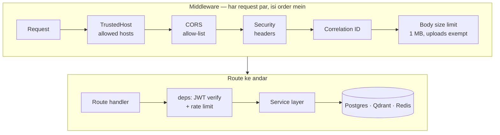

## 10.2 Endpoints (sab `/api/v1` ke neeche)

| Method + path | Auth | Kaam |
|---|---|---|
| `GET /health` | none | Liveness — `{"status":"ok","environment":…,"components":[]}` |
| `GET /health/ready` | none | Postgres + Redis + Qdrant check; koi down → **503** |
| `GET /me` | user | Token ka principal + company ka naam |
| `POST /auth/login` | none (10/min per account) | email + password → ID token, refresh token, ya `NEW_PASSWORD_REQUIRED` challenge |
| `POST /auth/new-password` | none | Pehli baar sign-in — challenge poora karke session |
| `POST /auth/refresh` | none | Refresh token → naya ID token |
| `POST /auth/forgot-password` | none (10/min) | Reset code email; **hamesha 202** |
| `POST /auth/confirm-password-reset` | none (10/min) | Code + naya password |
| `POST /auth/logout` | user | Cognito global sign-out — saare live tokens revoke |
| `POST /documents` | user (upload limit) | Upload |
| `GET /documents` | user | List (limit ≤ 200) |
| `GET /documents/{id}` · `/status` · `/download` | user | Detail, ingestion job, presigned URL |
| `DELETE /documents/{id}` | owner/admin | Soft delete + Qdrant points + S3 object |
| `POST /chat` | user | RAG |
| `POST /feedback` | user | Feedback |
| `GET /agents/workflows` · `POST /agents/run` | user (10/min) | Agentic workflows |
| `GET /admin/metrics` · `/admin/audit` · `/admin/security` | admin | Operations |
| `GET /admin/tenant` | admin | Apni company ka record (koi parameter nahi — sirf apni) |
| `GET /admin/users` | **tenant admin** | Apni company ke users |
| `POST /admin/users` | tenant admin | User invite (role: `user` ya `admin` hi) |
| `PATCH /admin/users/{id}` | tenant admin | Role, department, active status |
| `POST /admin/users/{id}/reset-password` | tenant admin | Cognito se one-time password email |
| `POST /platform/tenants` | **platform_admin** | Nayi company |
| `GET /platform/tenants` | platform_admin | Registry (platform tenant chhod kar) |
| `GET /platform/tenants/{id}` · `PATCH` | platform_admin | Ek company; naam/contact/active status |
| `POST /platform/tenants/{id}/admins` | platform_admin | Us company ka pehla admin invite |
| `GET /platform/audit` | platform_admin | Onboarding trail (`tenant.*`/`user.*`/`platform.*` hi) |

OpenAPI docs: `http://localhost:8000/docs` — **sirf dev mein** (`docs_url` dev ke bahar `None`).

<div class="callout info" markdown="1">
`/admin/users` ke liye `TenantAdminUser` chahiye, `AdminUser` nahi — matlab platform operator ko bhi 403 milta hai. Company onboard karne wala uski user directory se bahar rehta hai.
</div>

## 10.3 Error format

Har error: `{"error":{"code":"…","message":"…"},"correlation_id":"…"}` — stack trace ya SQL kabhi client ko nahi jaata (`core/exceptions.py`).

<div class="pagebreak"></div>

# 11. Database — PostgreSQL

## 11.1 Technology

PostgreSQL 16, async SQLAlchemy 2.0 + `asyncpg`, migrations **Alembic**.

- **Local:** Docker Compose container `postgres:16-alpine` (volume ke saath, data bachta hai).
- **AWS:** **Amazon RDS** — `ekba-dev-postgres`, `db.t4g.micro`, 20 GB gp3, single-AZ, encrypted, private subnets, SG sirf task SG se. Pehle ye ECS sidecar tha (task restart = khali DB); **ab data bachta hai** — task replace, naya deploy, sab ke baad. `destroy.sh` snapshot leta hai aur agla `deploy.sh` usi se restore karta hai.
- **Connection:** container startup par `DATABASE_URL` khud banta hai — `DB_HOST/DB_PORT/DB_NAME/DB_USER` (plain env) + `DB_PASSWORD` (Secrets Manager) + `?ssl=require`. Terraform RDS ka password **write-only** argument se deta hai, isliye password kabhi state ya plan mein nahi aata.
- **Migrations:** har task start par `alembic upgrade head` (schema sahi ho to no-op). Blue aur green **ek hi database** share karte hain, isliye migrations backward-compatible honi chahiye (Chapter 19.3).

## 11.2 Tables (10)

| Table | Kya hai | Tenant column |
|---|---|---|
| `tenants` | Company (id, name, slug, contact_email, created_by) | — (id khud tenant) |
| `users` | User (cognito_sub, tenant_id, email, role, department, invited_by) | ✅ FK |
| `documents` | File metadata, status, chunk_count, S3 `source_uri` | ✅ |
| `ingestion_jobs` | Processing job (status, progress, error) | ✅ |
| `conversations` | Chat thread | ✅ |
| `messages` | User + assistant messages, citations, model, confidence | ✅ |
| `request_usage` | Har AI call: tokens, cost, latency, cache_hit | ✅ |
| `user_feedback` | Rating (-1/1), reason, comment | ✅ |
| `prompt_releases` | Prompt versions | — (**runtime par use nahi hota**) |
| `audit_events` | Security/audit events (reason codes, payload kabhi nahi) | nullable |

## 11.3 ER diagram (simplified)

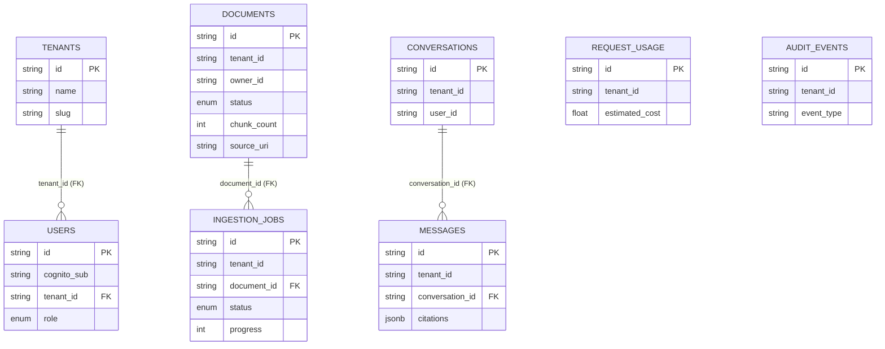

<div class="callout info" markdown="1">
**Dhyaan do:** `documents.tenant_id` ka `tenants` par foreign key **nahi** hai — ye sirf indexed column hai. Chunks database mein **nahi**, Qdrant mein hain.
</div>

## 11.4 Indexes (tenant filter fast rakhne ke liye)

`ix_documents_tenant_status`, `ix_documents_tenant_department`, `ix_jobs_tenant_status`, `ix_conversations_tenant_user`, `ix_messages_tenant_conv`, `ix_usage_tenant_created`, `ix_audit_tenant_created`, `ix_audit_type`, `ix_feedback_tenant`, `uq_users_tenant_email`.

## 11.5 Migrations

Do migrations:

| Revision | Kya karta hai |
|---|---|
| `0001_initial_schema` | Poora schema — 10 tables, enums, indexes |
| `0002_platform_onboarding` | `PLATFORM_ADMIN` enum label, `tenants.contact_email`, `tenants.created_by`, `users.invited_by`, aur reserved `platform` tenant row |

```bash
cd backend
alembic upgrade head        # schema banao/update
alembic current             # kaunsa revision laga hai
```

`0002` **poori tarah additive** hai — koi column drop nahi, koi data rewrite nahi, isliye purana tenant/user/document/conversation data waisa hi rehta hai. Do detail dhyaan dene layak:

- `ALTER TYPE user_role ADD VALUE IF NOT EXISTS 'PLATFORM_ADMIN'` — PostgreSQL enum labels **UPPERCASE** hain (Python values lowercase), aur PG12+ par ye transaction-safe hai jab tak nayi label usi transaction mein use na ho.
- Platform tenant `INSERT … ON CONFLICT (id) DO NOTHING` se aata hai, isliye migration dubara chalane par kuch nahi todta. Downgrade us tenant ko sirf tab delete karta hai jab usme koi user na ho.

Naya column: `models.py` edit → `alembic revision --autogenerate -m "…"` → generated file review → `alembic upgrade head` → tests. **Applied migration kabhi edit mat karo.**

<div class="pagebreak"></div>

# 12. Document Ingestion Flow

## 12.1 Diagram

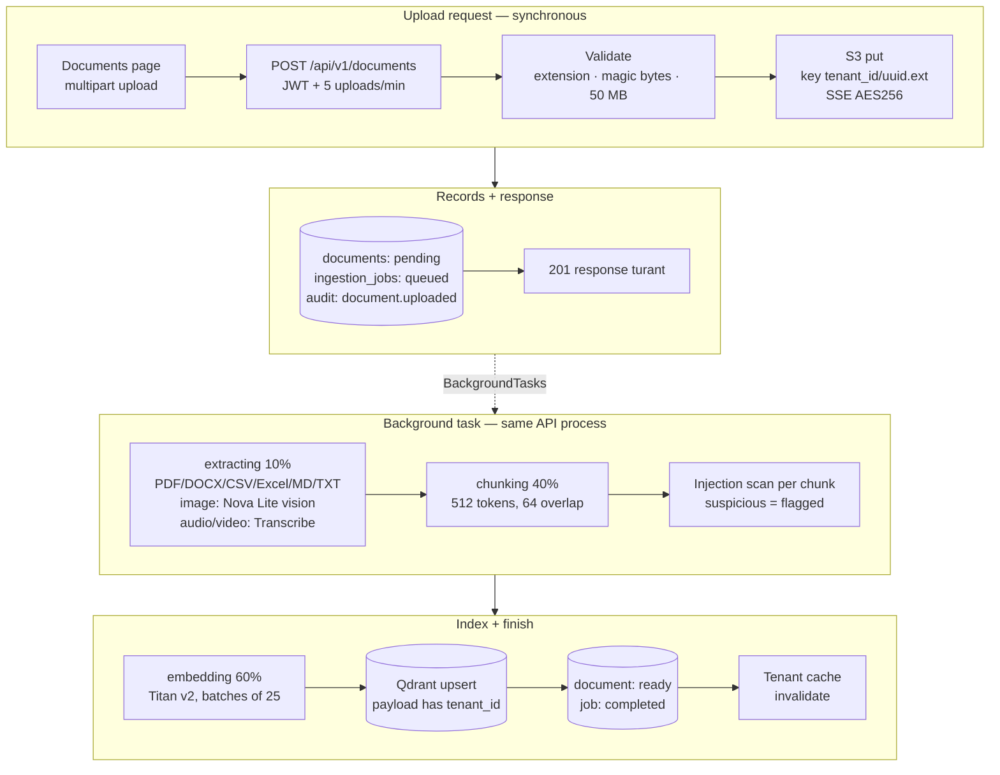

## 12.2 Har stage

| Stage | Input | Kya hota hai | Output | File |
|---|---|---|---|---|
| Validate | File | Extension allow-list, magic bytes, 50 MB cap, filename sanitize | Safe bytes | `security/files.py` |
| Store | Bytes | S3 (local: MinIO) mein `<tenant_id>/<uuid>.<ext>` | `source_uri` | `storage.py` |
| Record | — | `documents` (pending) + `ingestion_jobs` (queued) + audit | IDs | `api/v1/documents.py` |
| Extract | Bytes | Type ke hisaab se extractor | Text blocks (page/section ke saath) | `ingestion/extractors.py` |
| Chunk | Blocks | Paragraph → sentence boundaries, overlap | Chunks | `ingestion/chunker.py` |
| Scan | Chunk text | Hidden instructions dhoondhna (retrieval-poisoning defence) | `suspicious` flag | `security/injection.py → scan_content` |
| Embed | Chunks | 25-25 ke batch | 1024-dim vectors | `ai/provider.py` |
| Index | Vectors + payload | Qdrant upsert (tenant_id ke bina refuse) | Points | `vector.py` |
| Finish | — | Document `ready`, job `completed`, cache invalidate | — | `ingestion/pipeline.py` |

**Supported types** (`files.py`): pdf, txt, md, doc, docx, csv, xlsx, xls, png, jpg, jpeg, webp, gif, mp3, wav, m4a, flac, ogg, mp4, mov, webm.

<div class="callout warn" markdown="1">
**Likely limitation (test nahi kiya):** `.doc` aur `.xls` allow-list mein hain, lekin extractor `python-docx` (sirf `.docx`) aur `openpyxl` (sirf `.xlsx`) use karta hai. Purane binary `.doc`/`.xls` parse fail hone ki sambhavna hai. `requirements.txt` ke comment "DOC / DOCX", "XLSX / XLS" isse match nahi karte.
</div>

## 12.3 Status kaise badalta hai

Document: `pending → processing → ready` (ya `failed`), delete par `deleted`.
Job: `queued → extracting → chunking → embedding → completed` (ya `failed` + `error_code`). `transcribing` status enum mein hai.

**Failure par:** document `failed`, job `failed` with `error_code` (exception ka naam), audit event record hota hai. Background task crash kabhi silently nahi hota — `ingestion_task_crashed` log hota hai.

## 12.4 Manually check karna

```bash
# API se (token ke saath)
curl -s -H "Authorization: Bearer $TOKEN" http://localhost:8000/api/v1/documents/<DOC_ID>/status
# Local DB se
docker exec -it ekba-dev-postgres-1 psql -U ekba -d ekba \
  -c "select name,status,chunk_count from documents order by created_at desc limit 10;"
```

<div class="pagebreak"></div>

# 13. RAG Query Flow — Sabse Important Chapter

## 13.1 Example

User (northwind) poochta hai: **"What is the domestic hotel reimbursement limit?"**

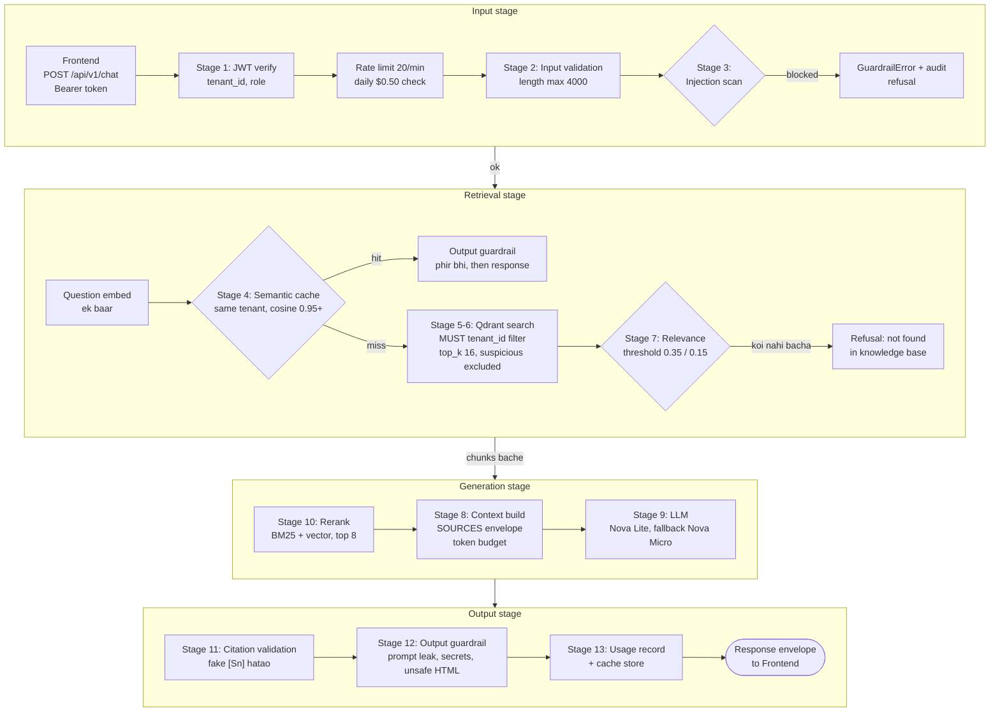

## 13.2 Har step — Hinglish mein

| # | Step | Input → Output | File |
|---|---|---|---|
| 1 | **Authentication** | Token → `RequestContext(user_id, tenant_id, role)` | `api/deps.py`, `core/auth.py` |
| — | Daily ceiling | Aaj ka `request_usage` sum ≥ $0.50 → "reached today's AI usage limit" | `api/v1/chat.py` |
| 2 | **Input validation** | Sawaal → cleaned sawaal (max 4000 chars, control chars reject) | `security/injection.py → validate_question` |
| 3 | **Injection scan** | Sawaal → safe / blocked. Pattern families: instruction_override, system_prompt_extraction, role_manipulation, guardrail_bypass, exfiltration, delimiter_injection, credential_probe, embedded_directive, hidden_instruction_marker, prompt_leak_bait (+ invisible chars, encoded blobs) | `injection.py` |
| — | Embed | Sawaal → 1024-dim vector (cache aur search dono ke liye ek hi call) | `ai/provider.py` |
| 4 | **Semantic cache** | Vector → cached answer agar **isi tenant** ka koi sawaal cosine ≥ 0.95 ho | `rag/cache.py` |
| 5–6 | **Tenant-filtered retrieval** | Vector → top 16 chunks, **`must: tenant_id == ctx.tenant_id`**, optional document_ids/department filter, `suspicious` chunks bahar | `vector.py → search` |
| 7 | **Relevance threshold** | Score < 0.35 (local 0.15) wale hatao; kuch na bache → "not found" answer, model call nahi | `rag/pipeline.py` |
| 10 | **Rerank** | BM25-style lexical score (weight 0.35) + vector score → top 8 | `rag/rerank.py` |
| 8 | **Context construction** | Chunks → `<<<BEGIN_SOURCES>>> … [S1] … <<<END_SOURCES>>>` data envelope, budget ~`8192×4` chars | `rag/prompts.py` |
| 9 | **Model call / routing** | System prompt + context + sawaal → answer text. Primary fail → fallback (logged, `model_used` mein dikhta) | `ai/provider.py` |
| 11 | **Citation validation** | `[Sn]` markers → sirf retrieved chunks map hote hain; invented hata diye, foreign-tenant citation drop | `rag/guardrails.py` |
| 12 | **Output guardrail** | System prompt echo, AWS key / private key / JWT, `<script>`, `javascript:` … → block | `rag/guardrails.py` |
| — | **Confidence** | `0.6 × avg(top-3 scores) + 0.4 × citation coverage − 0.2 × invented` | `guardrails.compute_confidence` |
| 13 | **Usage tracking** | Tokens, cost, latency → `request_usage`; clean answer + citations → cache | `repositories.record_usage` |
| 14 | **Language** | System prompt mein instruction | `prompts.py` |

Phir `chat.py` conversation + dono messages (user, assistant) DB mein save karta hai.

## 13.3 Response envelope (frontend ko kya milta hai)

`answer, citations[], retrieved_chunks[] (280-char preview), model_used, input_tokens, output_tokens, estimated_cost, latency_ms, cache_hit, tenant_id, confidence, correlation_id, conversation_id`

## 13.4 Hallucination kaise kam hota hai

1. Model ko sirf retrieved context diya jaata hai (system prompt: "grounded in provided context with citations").
2. Relevance threshold — kuch relevant nahi to model call hi nahi, seedha "not found".
3. Retrieved text **data envelope** mein — document ke andar likhi "instructions" follow nahi hoti.
4. Citation validation — banaya hua source number hata diya jaata hai aur confidence gir jaata hai.
5. Low temperature (`0.1`).

## 13.5 Local mode vs AWS mode

| | Local (`AI_PROVIDER=local`) | AWS (`AI_PROVIDER=bedrock`) |
|---|---|---|
| Embeddings | Hashed bag-of-words (deterministic, $0) | Titan Text Embeddings V2 |
| Chat | **Extractive stub** — context ki lines `[Sn]` ke saath quote karta hai, `model_used = "local-dev-stub"` | Nova Lite (fallback Nova Micro) |
| Threshold | 0.15 | 0.35 |
| Cost | $0 | Per token (Chapter 14) |

## 13.6 Agentic workflows (LangGraph)

`POST /api/v1/agents/run` — workflows: `policy_comparison`, `summarization`, `cross_document_analysis`, `knowledge_extraction`, `report_generation`.
Graph: `plan → retrieve → analyze → synthesize → cite`. Bounds: **MAX_STEPS = 12**, **timeout 120 s**; timeout par partial result (`partial: true`). Retrieval same tenant filter use karta hai. Input injection scan yahan bhi.

<div class="pagebreak"></div>

# 14. AI / LLM / Embeddings

## 14.1 Models

| Role | Model ID | Status |
|---|---|---|
| Chat primary | `us.amazon.nova-lite-v1:0` | **Configured** (AWS quota 0 → abhi blocked) |
| Chat fallback | `us.amazon.nova-micro-v1:0` (text-only) | Configured, fallback |
| Vision (images) | `us.amazon.nova-lite-v1:0` | Configured |
| Embeddings | `amazon.titan-embed-text-v2:0`, 1024 dims, normalized | Configured |
| Speech | Amazon Transcribe | Configured |
| Local dev | `local-dev-stub` (chat + embeddings) | **Active locally** |
| OpenAI / Azure / Vertex / Ollama | — | **Implemented nahi hai** (rules ke hisaab se allowed bhi nahi) |
| `gpt-oss` models | — | Plan mein the; `us-west-2` mein available nahi the → Nova se replace |

Model IDs **configuration** hain (`.env` / Terraform vars) — badalne ke liye code change nahi. Nova ko **inference-profile ID** (`us.` prefix) chahiye; bare ID par Bedrock `ValidationException` deta hai. Titan bina prefix ke.

## 14.2 Pricing table (code mein, `ai/registry.py`, per 1M tokens)

| Model | Input $ | Output $ |
|---|---|---|
| nova-micro | 0.035 | 0.14 |
| nova-lite | 0.06 | 0.24 |
| titan-embed-text-v2 | 0.02 | — |

## 14.3 Flow

```text
Question ──► Titan embed ──► vector ──► Qdrant search ──► chunks ──► Nova Lite ──► answer
Document ──► extract ──► chunks ──► Titan embed (batch 25) ──► vectors ──► Qdrant
Image    ──► Nova Lite vision (describe) ──► text ──► chunks ──► …
Audio/Video ──► Transcribe ──► transcript ──► chunks ──► …
```

<div class="callout danger" markdown="1">
**Operational limitation (2026-09-11):** Bedrock quotas 0. ECS logs mein aata hai `bedrock_embed_failed … ThrottlingException` → `UpstreamError: The embedding service is unavailable.` → `seed failed - continuing without demo data`. API healthy rehta hai; chat aur ingestion quota milne tak nahi chalenge. Quota check:

```bash
aws service-quotas list-service-quotas --service-code bedrock --region us-west-2 \
  --query "Quotas[?contains(QuotaName,'Titan Text Embeddings V2') || contains(QuotaName,'Nova Lite')].[QuotaName,Value]" --output table
```
</div>

<div class="pagebreak"></div>

# 15. Qdrant — Vector Database

**Vector database kya hai?** Normal DB exact match dhoondhta hai; vector DB **meaning** se milti-julti cheez dhoondhta hai.
**Embedding** = text ka numbers mein roop (yahan 1024 numbers ki list). Milte-julte meaning wale text ke vectors paas-paas hote hain.
**Similarity search** = sawaal ke vector ke sabse paas wale chunk vectors dhoondhna (yahan **cosine** distance).

| Setting | Value |
|---|---|
| Image | `qdrant/qdrant:v1.12.4` |
| Collection | `ekba_chunks` (`QDRANT_COLLECTION`) |
| Dimension | 1024, distance **COSINE** |
| Payload index | `tenant_id` (KEYWORD) — mandatory filter ke liye |
| Startup | `ensure_collection()` — collection na ho to banata hai; dimension mismatch par error ("create a new collection and re-index") |

**Har point ka payload:** `tenant_id, document_id, chunk_id, document_name, page_number, section, source_uri, owner_id, document_version, created_by, created_at, text, modality, department, suspicious`.

**Tenant filter:** `vector.search` khud `must: tenant_id == ctx.tenant_id` banata hai — koi caller filter override nahi kar sakta. `upsert_chunks` bina `tenant_id` wala chunk likhne se mana karta hai.

```text
"Leave policy" PDF → 4 chunks → 4 vectors (payload: tenant_id=northwind…) → Qdrant
"annual leave carry over?" → vector → cosine search (northwind only) → best chunk → answer
```

Local dekhna: `http://localhost:6333/dashboard` (Qdrant UI) ya
`curl -s http://localhost:6333/collections/ekba_chunks` (`points_count` dekho — seed ke baad 41).

<div class="pagebreak"></div>

# 16. Redis — Cache aur Rate Limit

Redis `redis:7-alpine`, **persistence off** (`--save "" --appendonly no`) — restart par sab khali.

| Use | Key pattern | TTL |
|---|---|---|
| Rate limit | `ekba:rl:<bucket>:<tenant_id>:<user_id>` | 60 s window |
| Semantic cache index | `ekba:sc:idx:<tenant_id>` (last 50 question digests) | 3600 s |
| Semantic cache entry | `ekba:sc:e:<tenant_id>:<sha256[:32]>` (answer, citations, vector, model, confidence) | 3600 s |

**Cache hit** = isi tenant ka pehle ka sawaal cosine ≥ 0.95. **Miss** = poori RAG pipeline. Document upload/delete par us tenant ka cache **invalidate**.

**Redis down ho to?** Cache ke errors pakde jaate hain (`# cache must never break the request path`) — chat chalta rahega bina cache ke. Rate limiting Redis par depend karta hai; `/health/ready` Redis ko unhealthy dikhayega.

<div class="pagebreak"></div>

# 17. Data Storage Map — Kya Kahan Rehta Hai

| Data | Kahan | Kyun | Kaise dekhein |
|---|---|---|---|
| Original files | **S3** (local: MinIO) `<tenant>/<uuid>.<ext>` | Persistent, encrypted | `aws s3 ls s3://<BUCKET>/<tenant>/` · MinIO console `http://localhost:9001` |
| Document metadata, jobs, conversations, messages, usage, feedback, audit | **PostgreSQL** — local: container; AWS: **RDS** (data bachta hai) | Relational | Local: `docker exec -it ekba-dev-postgres-1 psql -U ekba -d ekba`; AWS: sirf API/logs se |
| Chunks + embeddings | **Qdrant** `ekba_chunks` | Vector search | `http://localhost:6333/dashboard` |
| Cache + rate limit counters | **Redis** | Speed / abuse control | `docker exec -it ekba-dev-redis-1 redis-cli --scan --pattern 'ekba:*'` |
| User identity, tenant, role | **Cognito** (AWS) / dev token (local) | Auth | Cognito console / `list-users` |
| Secrets | **Secrets Manager** (AWS) / `.env` (local, git-ignored) | Security | Sirf naam dekho, value nahi |
| App logs | **CloudWatch** `/ekba/dev/service` (AWS) / terminal (local) | Debugging | `aws logs tail` |
| Terraform state | S3 `ekba-tfstate-<ACCOUNT_ID>` + DynamoDB lock | Infra record | `terraform state list` (kabhi haath se edit nahi) |
| Deployment reports | `docs/reports/*.md` (local files) | Audit trail | File kholo (account ID hota hai — commit mat karo) |

<div class="callout warn" markdown="1">
**AWS par PostgreSQL RDS hai (private subnets) aur Qdrant/Redis task ke andar containers hain.** Dono tak direct public raasta nahi: RDS ka SG sirf task SG se allow karta hai, aur task ka SG sirf ALB se. AWS par data dekhna ho to **API endpoints** (admin metrics, documents list) ya CloudWatch logs use karo. ECS Exec configure **nahi** hai.
</div>

<div class="pagebreak"></div>

# 18. Local Development — Laptop Par Poora Project

## 18.1 Picture

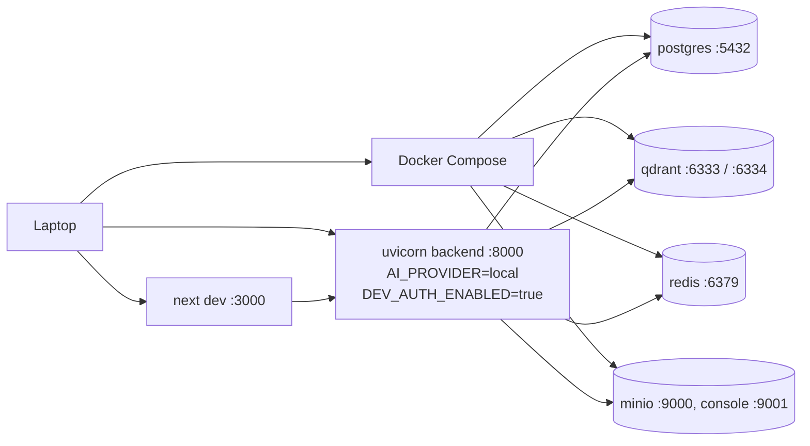

Local mein **$0** — koi AWS nahi, local AI stub, local dev tokens.

## 18.2 Sabse aasaan raasta — ek command

```bash
./scripts/setup-local.sh          # Git Bash / macOS / Linux
.\scripts\setup-local.ps1         # Windows PowerShell
```

Ye 7 steps karta hai: prerequisites check → `.env` banana (generated secrets) → backend deps → containers → migrations → seed → frontend deps. Dobara chalana safe hai.

## 18.3 Haath se, step by step (RUNBOOK Part A se verified)

**Step 1 — `.env` banao**

```bash
cp .env.example .env
```

Paanch values set karo: `POSTGRES_PASSWORD`, `DATABASE_URL` (same password), `DEV_AUTH_SECRET` (32+ chars), `DEV_AUTH_PASSWORD` (jo password se tum local accounts mein login karoge), `S3_BUCKET=ekba-dev-documents`. Local ke liye ye rehne do: `ENVIRONMENT=dev`, `AI_PROVIDER=local`, `DEV_AUTH_ENABLED=true`, `S3_ENDPOINT_URL=http://localhost:9000`, `RATE_LIMIT_AUTH_ATTEMPTS_PER_MIN=10`.

**Step 2 — Containers**

```bash
docker compose --env-file .env -f infra/docker/docker-compose.yml up -d postgres qdrant redis minio minio-init
docker compose --env-file .env -f infra/docker/docker-compose.yml ps
```

<div class="callout warn" markdown="1">
`--env-file .env` **zaroori hai** — compose file `infra/docker/` mein hai, bina iske root `.env` nahi padha jaata aur password mismatch hota hai.
</div>

**Step 3 — Backend install**

```bash
cd backend
python -m venv .venv
source .venv/Scripts/activate        # Git Bash   (PowerShell: .\.venv\Scripts\Activate.ps1)
pip install -r requirements.txt -r requirements-dev.txt
```

**Step 4 — Tables** → `alembic upgrade head`
**Step 5 — Demo data** → `python -m seeds.seed` (output mein `chunks_indexed: 41`)
**Step 6 — Backend** → `uvicorn app.main:app --reload --port 8000`
**Step 7 — Frontend** (naya terminal) → `cd frontend && npm install && npm run dev`
**Step 8 — Kholo** → `http://localhost:3000`, aur kisi bhi seeded email + `DEV_AUTH_PASSWORD` se login karo:

| Email | Role |
|---|---|
| `priya@northwind.example` | user |
| `admin@northwind.example` | company admin |
| `platform@ekba.example` | platform operator |
| `admin@contoso.example` | doosri company ka admin (isolation demo) |

**Step 9 (optional) — Token chahiye to** → `cd backend && python -m seeds.dev_token [--role admin|platform_admin]`, phir sign-in page par "Developer sign-in" kholo aur paste karo.

## 18.4 Check, logs, docs

```bash
curl http://localhost:8000/api/v1/health          # liveness
curl http://localhost:8000/api/v1/health/ready    # postgres + redis + qdrant
# API docs (sirf dev): http://localhost:8000/docs
docker compose --env-file .env -f infra/docker/docker-compose.yml logs -f qdrant
```

Backend logs uvicorn wale terminal mein aate hain (JSON lines, `correlation_id` ke saath).

## 18.5 Stop / restart

```bash
# Backend / frontend: us terminal mein Ctrl+C
docker compose --env-file .env -f infra/docker/docker-compose.yml stop     # containers roko, data rahe
docker compose --env-file .env -f infra/docker/docker-compose.yml down     # containers hatao, volumes rahein
docker compose --env-file .env -f infra/docker/docker-compose.yml down -v  # DATA BHI DELETE
```

Port 8000 atka ho (PowerShell):

```powershell
Get-NetTCPConnection -LocalPort 8000 -State Listen | ForEach-Object { Stop-Process -Id $_.OwningProcess -Force }
```

<div class="callout warn" markdown="1">
**Dev server chalte hue `npm run build` mat chalao.** Dono `frontend/.next` share karte hain — build dev server ki files overwrite kar deta hai aur pages load hona band ho jaata hai. Pehle dev server roko.
</div>

<div class="pagebreak"></div>

# 19. AWS Production Flow

## 19.1 Frontend

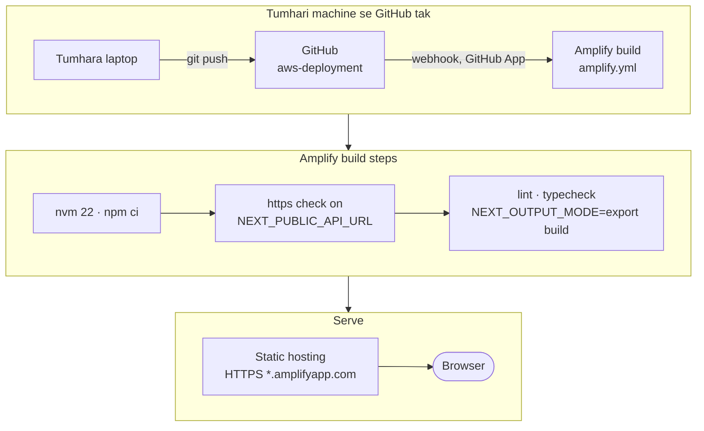

## 19.2 Backend

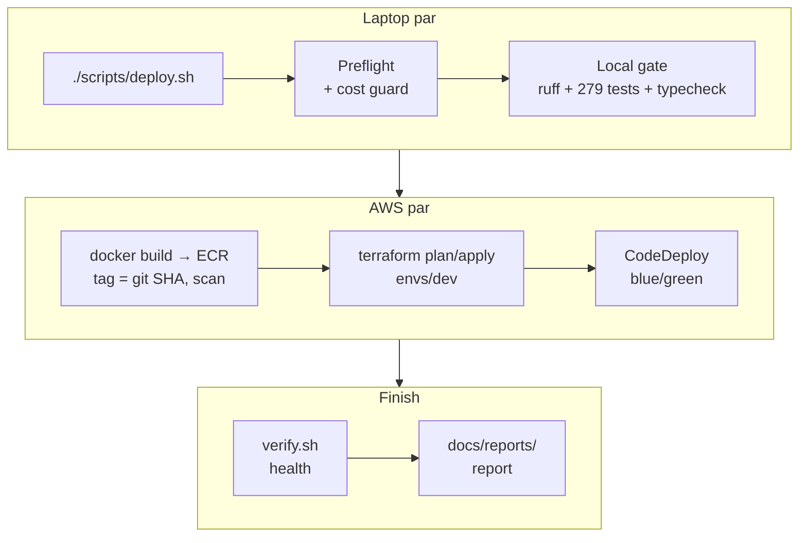

Backend deploy **tumhare laptop se** hota hai — git push se automatically **nahi** hota.

## 19.3 Blue/green — kaise kaam karta hai

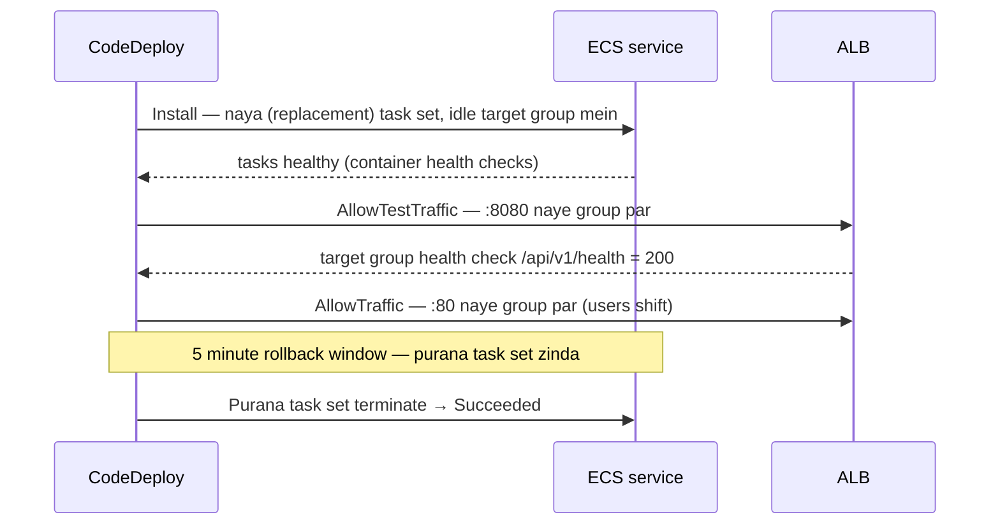

Har `deploy.sh` ek poora blue/green karta hai (~9 min CodeDeploy, ~11–12 min total), chahe kuch na badla ho. Target groups `ekba-dev-blue` ↔ `ekba-dev-green` har baar roles badalte hain.

<div class="callout info" markdown="1">
**Honest note:** AppSpec mein lifecycle hooks **nahi** hain — green ka test sirf container health checks + ALB health check (`/api/v1/health`, liveness) hai. DB/Qdrant/Redis/RAG smoke test deployment ke dauran nahi hota (rules mein required hai, implemented nahi).
</div>

<div class="pagebreak"></div>

# 20. "Mujhe Code Change Karna Hai — Ab Kya Karu?"

## 20.1 Backend change

```bash
git status                          # 1. kya badla hai
cd backend && source .venv/Scripts/activate
ruff check app tests seeds && ruff format --check app tests seeds    # 2. lint
ENVIRONMENT=dev AI_PROVIDER=local DEV_AUTH_ENABLED=true \
  pytest tests/unit tests/integration tests/security tests/evaluation -q   # 3. tests
cd .. && git diff                   # 4. review
git add <files> && git commit -m "…"   # 5. commit (image tag = commit SHA)
git push origin <branch>            # 6. push (backup + CI agar main)
curl -s https://checkip.amazonaws.com   # 7. IP == allowed_cidrs? (Chapter 28)
./scripts/deploy.sh                 # 8. deploy
```

`deploy.sh` khud karta hai: cost guard → local gate (dobara) → Docker build → ECR push (immutable SHA tag; image pehle se ho to reuse) → scan → `terraform fmt/validate/plan` → **destroy/delete dikhe to typed confirmation** `I REVIEWED THIS PLAN` → apply → CodeDeploy → `verify.sh` → report.

<div class="callout warn" markdown="1">
**`backend/` ya `backend.Dockerfile` mein uncommitted changes hon to `deploy.sh` ruk jaata hai** — image ka tag commit SHA hai, isliye image mein exactly wahi commit hona chahiye. Pehle commit karo.
</div>

Terraform change bhi ho (jaise naya env var): wahi `deploy.sh` — plan mein dikhega (task definition "must be replaced" normal hai, Chapter 24.3).

## 20.2 Frontend change

```bash
cd frontend
npm run lint && npm run typecheck
NEXT_OUTPUT_MODE=export NEXT_PUBLIC_API_URL=https://example.invalid npm run build   # Amplify jaisa build
cd .. && git add frontend/… && git commit -m "…"
git push origin aws-deployment      # ← yahi deploy hai: Amplify auto-build (~4 min)
./scripts/deploy-frontend.sh        # optional: 12 checks se verify
```

Terraform **zaroori nahi** — sirf code change hai to push kaafi hai. Terraform tab chahiye jab Amplify settings/CloudFront badalne hon (`deploy-frontend.sh` wo karta hai).

## 20.3 Decision tree

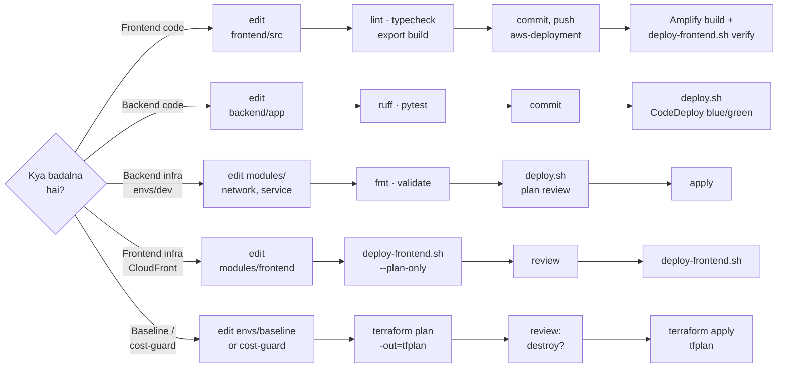

<div class="pagebreak"></div>

# 21. Branch Strategy — Asli Setup

| Branch | Abhi kahan | Kya trigger karta hai |
|---|---|---|
| `aws-deployment` | `15c2a00` (latest) | **Amplify auto-build** (frontend). CI **nahi** chalta |
| `main` | `dd545c4` (**peeche hai**) | CI (`ci.yml`: push to `main`/`develop`, PR to `main`) |
| `develop` | exist nahi karta | CI trigger list mein hai |

Backend deploy **kisi branch push se nahi** — `./scripts/deploy.sh` jo bhi local commit checked-out hai use deploy karta hai. `deploy.yml` (GitHub Actions) manual hai aur **abhi tak run nahi hua** (Chapter 25).

**Tumhara intended workflow:** `main` pe kaam → `aws-deployment` mein merge → push → Amplify.

<div class="callout warn" markdown="1">
**Pehle ek baar sync karna padega:** `main` abhi 6 commits peeche hai. Jab tum decide karo:

```bash
git checkout main
git pull origin main
git merge --ff-only aws-deployment    # fast-forward, koi merge commit nahi
git push origin main
```

Uske baad roz ka flow:

```bash
git checkout main && git pull
# … kaam …
git add <files> && git commit -m "…" && git push origin main    # CI chalega
git checkout aws-deployment && git pull
git merge main                                                   # ya --ff-only
git push origin aws-deployment                                   # Amplify deploy
```
</div>

`git add .` se bacho — reports (`docs/reports/2026*.md`, account ID ke saath) untracked padi rehti hain; files naam se add karo.

<div class="pagebreak"></div>

# 22. Stop / Start / Destroy — Cheat Sheet

## 22.1 Stop vs Destroy

| | Matlab | Kharcha |
|---|---|---|
| **STOP** | Temporarily band — resource rehta hai | Band cheez ka compute bachta, par ALB jaisi cheezein chalti rehti hain |
| **DESTROY** | Resource hi hata do (database ka snapshot pehle ban jaata hai) | `envs/dev` ka poora ~$0.11/hr khatam |

<div class="callout warn" markdown="1">
**Project mein AWS "stop" script nahi hai.** Supported tareeka `destroy.sh` hai. ECS ko haath se 0 par scale karna (`aws ecs update-service --desired-count 0`) ALB ka kharcha nahi rokta (~$24/month idle) aur Terraform drift banata hai — cost guard (armed hone par) exactly yahi + ALB delete karta hai.
</div>

## 22.2 Commands

| Kaam | Command |
|---|---|
| Local frontend stop / start | Ctrl+C / `cd frontend && npm run dev` |
| Local backend stop / start | Ctrl+C / `cd backend && uvicorn app.main:app --reload --port 8000` |
| Local containers stop / start | `docker compose --env-file .env -f infra/docker/docker-compose.yml stop` / `up -d …` |
| AWS kya chal raha hai | `./scripts/cost-check.sh` |
| AWS backend deploy / update | `./scripts/deploy.sh` |
| AWS frontend deploy / verify | `git push origin aws-deployment` / `./scripts/deploy-frontend.sh` |
| **AWS backend destroy** | `./scripts/destroy.sh` → type `DESTROY ekba-dev` |
| Destroy ke baad wapas | `./scripts/deploy.sh` **phir** `./scripts/deploy-frontend.sh` |

## 22.3 `destroy.sh` kya karta hai

1. Account, region, workspace, state verify
2. Har resource print karta hai jo hatega
3. Plan mein protected cheez (secrets, ECR, state backend, budget, IAM user…) → **abort**
4. Typed confirmation `DESTROY ekba-dev` (sirf `y` nahi)
5. Sirf `envs/dev` state destroy
6. Secrets bache hain confirm + audit report

**Bachta hai:** baseline (ECR images, S3 documents, Cognito, secrets, budget, audit logs, OIDC role), cost guard, frontend (Amplify + CloudFront), state backend.
**Hatta hai:** VPC, subnets, SGs, ALB, target groups, ECS cluster/service/task defs, CodeDeploy app, task IAM roles, service log group, alarms.

## 22.4 Destroy ke baad redeploy

```bash
./scripts/deploy.sh             # naya ALB (naya DNS naam); frontend.auto.tfvars se CORS + CloudFront ingress khud lagta hai
./scripts/deploy-frontend.sh    # CloudFront origin naye ALB par (in-place), rebuild nahi
```

Frontend aur API URL **same** rehte hain.

## 22.5 Rollback — galat version live ho gaya to kya karu?

| Kya | Kaise | Detail |
|---|---|---|
| **Frontend** — pichla build wapas | `./scripts/rollback-frontend.sh` | Live build se pehle wala last successful build dobara release karta hai (Amplify job) |
| Frontend — specific commit | `./scripts/rollback-frontend.sh --to <COMMIT_SHA>` | Us commit ka build |
| Frontend — rollback permanent karna | `git revert <BAD_SHA>` → `git push origin aws-deployment` | Agla push branch head ko hi deploy karta hai, isliye bina revert ke rollback agle push par hat jaata hai |
| **Backend** — automatic | CodeDeploy khud | Deployment fail (`DEPLOYMENT_FAILURE`) ya alarm `ekba-dev-5xx` → traffic purane (blue) task set par. Purana set 5 minute zinda rehta hai. Configured hai, **abhi tak exercise nahi hua** |
| Backend — deployment chal raha ho | `aws deploy stop-deployment --deployment-id <DEPLOYMENT_ID> --auto-rollback-enabled` | Sirf in-flight deployment ke liye |
| Backend — deploy ho chuka, galat nikla | `git revert <BAD_SHA>` → commit → `./scripts/deploy.sh` | "Fix forward": naya image, naya blue/green deploy. Recommended tareeka |

<div class="callout warn" markdown="1">
**`./scripts/rollback.sh` traffic wapas NAHI shift karta.** Uska CodeDeploy step code mein "not yet implemented (Phase 5)" hai — ye sirf `verify.sh` chalata hai aur report likhta hai. Isliye backend rollback = CodeDeploy auto-rollback ya `git revert` + `deploy.sh`.

Purana commit `git checkout` karke `deploy.sh` chalana possible hai (same SHA ka image ECR mein ho to reuse hota hai), lekin us commit ka **Terraform bhi apply hoga** — purana Terraform naye infra se mismatch kar sakta hai. Isse bacho.
</div>

**AWS frontend "stop" karna:** Project mein currently ye implemented nahi hai — Amplify ka koi stop button/script nahi hai aur `destroy.sh` frontend ko touch nahi karta. Zaroorat bhi nahi: idle Amplify + CloudFront ka kharcha ~$0 hai. Backend destroy ho to site khulti rahegi par "Could not reach the API" dikhayegi. `envs/frontend` par seedha `terraform destroy` project rules ke khilaaf hai (destroy sirf `destroy.sh` se).

<div class="pagebreak"></div>

# 23. Docker

**Image** = packaged app (code + dependencies). **Container** = image ka chalta hua instance. **Port** = bahar se andar ka raasta (`-p 8000:8000`). **Volume** = container ke bahar data (restart par bachta hai). **Network** = containers aapas mein baat karein. **Compose** = kai containers ek file se.

| File | Kya |
|---|---|
| `infra/docker/docker-compose.yml` | Local: postgres, qdrant, redis, minio, minio-init, + optional `api` aur `web` |
| `infra/docker/backend.Dockerfile` | `python:3.12-slim`, non-root user `ekba` (uid 10001), port 8000, HEALTHCHECK, `uvicorn` |
| `infra/docker/frontend.Dockerfile` | `node:22-alpine`, Next.js standalone (Amplify ise use nahi karta) |

```bash
docker ps                    # "process status" — chal rahe containers
docker ps -a                 # ruke hue bhi
docker images                # images
docker logs -f ekba-dev-postgres-1
docker compose --env-file .env -f infra/docker/docker-compose.yml up -d
docker compose --env-file .env -f infra/docker/docker-compose.yml down
docker build -f infra/docker/backend.Dockerfile -t ekba-backend:local .
```

AWS par Docker Compose **nahi** — wahi chaar images ECS task definition mein containers ban kar chalti hain.

<div class="pagebreak"></div>

# 24. Terraform — Beginner Guide

## 24.1 Basic commands

| Command | Matlab |
|---|---|
| `terraform init -backend-config=backend.hcl` | Providers download + remote state se jodna |
| `terraform fmt -recursive` | Code format |
| `terraform validate` | Syntax/logic check (AWS ko touch nahi karta) |
| `terraform plan -out=tfplan` | "Kya badlega" — **padho!** |
| `terraform apply tfplan` | Sirf wahi reviewed plan lagao |
| `terraform destroy` | **Is project mein sirf `scripts/destroy.sh` ke through** |

**State** = Terraform ki diary ki usne kya banaya. **Backend** = state kahan rehti (S3 + DynamoDB lock). **tfvars** = real values (git-ignored). **Module** = reusable block (`modules/`). **Environment** = `envs/<name>` — har ek ki alag state.

## 24.2 Chaar states

| State | Key | Kaun chalata hai | Destroy? |
|---|---|---|---|
| `envs/baseline` | `baseline/terraform.tfstate` | Haath se, ek baar | Kabhi nahi |
| `envs/cost-guard` | `cost-guard/terraform.tfstate` | Haath se | Kabhi nahi |
| `envs/dev` | `dev/terraform.tfstate` | **Sirf `deploy.sh`** (image + snapshot var deta hai) | Sirf `destroy.sh` (pehle DB snapshot) |
| `envs/frontend` | `frontend/terraform.tfstate` | **Sirf `deploy-frontend.sh`** (ALB + app ID var deta hai) | Kabhi nahi (script nahi) |

Har folder mein git-ignored `backend.hcl` (account ID) aur `terraform.tfvars` (real values); commit hota hai sirf `.example`.

## 24.3 "Plan mein destroy/replace dikha — ab kya karu?"

<div class="callout danger" markdown="1">
**Kabhi blindly apply mat karo.** Checklist:

1. **Kaunsa resource?** `terraform show tfplan | grep -E "destroyed|replaced"`
2. **Kyun?** Us resource ke andar `# forces replacement` wali line dhoondho — wahi attribute wajah hai.
3. **Kya ye expected hai?** Neeche table dekho.
4. **Data jayega?** S3, secrets, Cognito, ECR — inka replace **kabhi** accept mat karo.
5. **Unsure ho to ruko.** Plan file delete karo, kuch apply mat karo.
</div>

| Plan mein | Normal hai? | Kyun |
|---|---|---|
| `aws_ecs_task_definition.app must be replaced` | ✅ Haan | Task definition revisions immutable hain; env var/image change = nayi revision |
| `aws_security_group.alb updated in-place` | ✅ | Ingress rule change |
| `aws_amplify_app … must be replaced` | ❌ **NAHI** | Real example is project se: console ne `iam_service_role_arn` lagaya tha; Terraform use hataana chahta tha → provider app **replace** karta (GitHub connection khatam). Fix: `lifecycle { ignore_changes = [iam_service_role_arn] }` |
| Kuch bhi `destroy` baseline mein | ❌ | Baseline protected hai |

## 24.4 State lock atka ho

`Error acquiring the state lock` → pehle check karo koi aur terraform/deploy chal to nahi raha. Sach mein atka ho tab hi `terraform force-unlock <LOCK_ID>` — ye human decision hai, rule ke hisaab se record karo.

<div class="pagebreak"></div>

# 25. CI/CD — GitHub Actions

## 25.1 `ci.yml` (automatic)

**Trigger:** push to `main`/`develop`, pull request to `main`. (**`aws-deployment` par nahi.**)

| Job | Steps | Blocking? |
|---|---|---|
| backend | ruff lint, mypy, pytest unit/integration/security/evaluation | mypy **non-blocking** (warning) |
| frontend | npm ci, typecheck, lint, build, static-export build | Blocking |
| security | gitleaks secret scan, pip audit, npm audit, checkov (Terraform) | npm audit warning; checkov `soft_fail` |
| terraform | fmt -check, validate baseline/dev/cost-guard/frontend | Blocking |
| docker | backend image build, Trivy scan, non-root check | Blocking |

## 25.2 `deploy.yml` (manual, `workflow_dispatch`)

Type `DEPLOY` → OIDC role → build/push → plan → reject destroys → apply → CodeDeploy → health → verify → rollback on failure.

<div class="callout warn" markdown="1">
**Abhi tak run nahi hua, aur 3 known problems hain:** (1) iska cost check credits ke baad ka spend padhta hai aur deploy role ke paas `ce:GetCostAndUsage` nahi — kabhi block nahi karega; (2) GitHub runner ka IP `DEMO_ALLOWED_CIDR` mein nahi — health check ALB tak nahi pahunchega (CloudFront URL use karna fix hoga); (3) `allowed_cidrs` do jagah se set hota hai. **Backend ke liye `./scripts/deploy.sh` use karo.**
</div>

Required GitHub settings (deploy.yml ke liye): repo variables `AWS_REGION`, `EXPECTED_AWS_ACCOUNT_ID`, `DEMO_ALLOWED_CIDR`, `S3_BUCKET`, `COGNITO_CLIENT_ID`; secret `AWS_DEPLOY_ROLE_ARN`. Ye set hain ya nahi — repository se confirm nahi ho paya.

<div class="pagebreak"></div>

# 26. Testing

| Kya | Command | Kahan se |
|---|---|---|
| Backend lint | `ruff check app tests seeds` · `ruff format --check app tests seeds` | `backend/` |
| Unit | `pytest tests/unit -q` | mocks, no services |
| Integration | `pytest tests/integration -q` | API smoke, RAG pipeline |
| Security | `pytest tests/security -q` | tenant isolation, guardrails, platform security, agent isolation, **role hierarchy** |
| Evaluation | `pytest tests/evaluation -q` | RAG quality harness |
| Onboarding journey | `pytest tests/e2e -q` | Do companies onboard karke isolation prove karta hai (**PostgreSQL chahiye**) |
| Sab ek saath (deploy gate) | `ENVIRONMENT=dev AI_PROVIDER=local DEV_AUTH_ENABLED=true pytest tests/unit tests/integration tests/security tests/evaluation -q` → **279 tests** | `deploy.sh` |
| Frontend | `npm run lint` · `npm run typecheck` · `npm run build` | `frontend/` |
| Amplify jaisa build | `NEXT_OUTPUT_MODE=export NEXT_PUBLIC_API_URL=https://x.invalid npm run build` | `frontend/` |
| E2E (Playwright, 29 journeys) | `./scripts/test-e2e.sh` (tokens khud banata hai) ya `npx playwright test` | local stack chahiye |
| Cost-guard Lambda | `backend/.venv/Scripts/python.exe -m pytest infra/terraform/modules/cost-guard/lambda/tests -q` (27) | repo root |
| Terraform | `terraform fmt -check -recursive infra/terraform` · `terraform -chdir=… validate` | |

```text
CODE CHANGE → lint/typecheck → tests → build → commit → deploy (script) → verify (script)
```

**Rule:** test ko kabhi weak/delete mat karo build pass karane ke liye — code fix karo.

<div class="pagebreak"></div>

# 27. Monitoring & Logs — "Problem Aaya To Sabse Pehle Kahan Dekhu?"

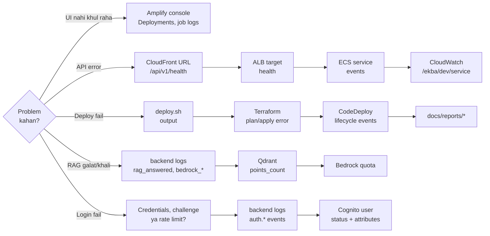

**Correlation ID:** har request ka `X-Correlation-ID` frontend banata hai; backend har log line, error response aur audit event mein wahi ID rakhta hai. Error ke `correlation_id` se logs mein search karo.

```bash
MSYS_NO_PATHCONV=1 aws logs filter-log-events --log-group-name /ekba/dev/service \
  --log-stream-name-prefix api --filter-pattern '"<CORRELATION_ID>"' --query 'events[].message' --output text
```

**Aur jagah:** admin UI (AI Metrics, Security, Audit pages), `audit_events` table, `./scripts/cost-check.sh`, CloudWatch alarms `ekba-dev-5xx` / `ekba-dev-latency`.

**Monitoring ki limitations:** custom CloudWatch metrics (tokens, cost, cache hits as metrics) aur LangSmith tracing — **implemented nahi hain**; ye data `request_usage` table aur admin metrics endpoint mein hai.

<div class="pagebreak"></div>

# 28. Troubleshooting Playbook

## 28.1 "Kuch toot gaya" — decision tree

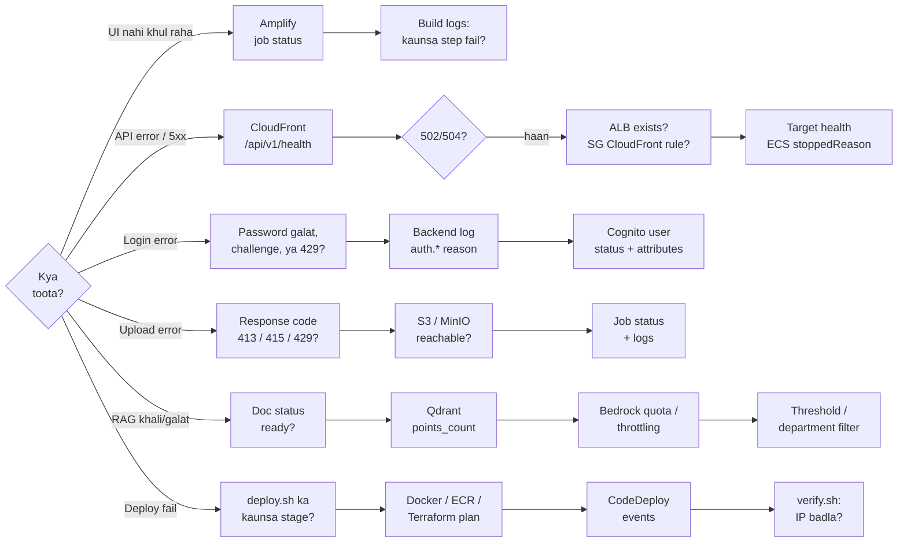

## 28.2 Problem → Check → Command → Wajah → Fix

**Frontend / Amplify**

| Problem | Check / Command | Possible cause | Fix |
|---|---|---|---|
| Frontend nahi khul raha | `aws amplify list-jobs --app-id <APP_ID> --branch-name aws-deployment --query 'jobSummaries[0].[jobId,status]'` | Latest build failed | Console → job → BUILD logs |
| Build fail: `NEXT_PUBLIC_API_URL must be an https:// URL, got ''` | Build log | App par env var set nahi (console se naya app banane par pehli build) | `./scripts/deploy-frontend.sh` (Terraform env var set karta hai) |
| Build fail: `Monorepo spec provided without "applications" key` | Build log (build "completed successfully" ke **baad**) | Custom headers galat format mein | `modules/frontend/main.tf` — headers `applications[].appRoot` ke neeche (fix commit `6a3e2ef`) |
| Page khulta hai par "Could not reach the API" | Browser DevTools → Network | API down / galat `NEXT_PUBLIC_API_URL` / CORS | Neeche API aur CORS rows |
| Unknown URL par 200 aata hai, 404 nahi | `curl -sIL <SITE>/nope` | Amplify ka behaviour: `301 → 302 → /404.html → 200` | Expected — visitor ko not-found page dikhta hai |

**API path (CloudFront → ALB → ECS)**

| Problem | Check / Command | Possible cause | Fix |
|---|---|---|---|
| CloudFront **504** | `curl -s -o /dev/null -w '%{http_code}' https://<CF>/api/v1/health` | ALB SG CloudFront ko allow nahi karta | `deploy-frontend.sh` (wiring) / `deploy.sh` |
| CloudFront **502/504**, ALB gayab | `aws elbv2 describe-load-balancers --names ekba-dev-alb` | `destroy.sh` ya armed cost guard ne ALB hataya | `./scripts/destroy.sh` (cleanup) → `deploy.sh` → `deploy-frontend.sh` |
| ALB targets unhealthy | `aws elbv2 describe-target-health --target-group-arn <TG_ARN>` | Container crash / health path | ECS events + logs; health path `/api/v1/health` TrustedHost se exempt hai |
| Target `unused` mid-deploy | same | Us group par abhi listener nahi | Normal jab tak `AllowTestTraffic` |
| ECS task stopped / baar-baar restart | `aws ecs describe-tasks --cluster ekba-dev --tasks <TASK_ARN> --query 'tasks[0].[stoppedReason,containers[].[name,exitCode,reason]]'` | Secret missing, image pull fail, essential container (redis/qdrant) down, ya RDS reachable nahi | CloudWatch `/ekba/dev/service` stream prefix dekho |
| `verify.sh`: `FAIL health endpoint`, curl exit 28 | `curl -s https://checkip.amazonaws.com` vs `grep allowed_cidrs infra/terraform/envs/dev/terraform.tfvars` | **Tumhara IP badal gaya** (ISP) | `allowed_cidrs` update → `deploy.sh` (1 in-place SG change) |
| CORS error browser mein | `curl -s -D - -o /dev/null -X OPTIONS https://<CF>/api/v1/me -H "Origin: <SITE>" -H "Access-Control-Request-Method: GET"` | Live task definition mein origin nahi | `deploy-frontend.sh` (frontend.auto.tfvars) → `deploy.sh` |
| `400 Bad Request` har call par | Local: `.env` | Host `TRUSTED_HOSTS` mein nahi | Host add karo |

**Deploy**

| Problem | Check / Command | Possible cause | Fix |
|---|---|---|---|
| `SubscriptionRequiredException` (CodeDeploy) | `aws freetier get-account-plan-state --region us-east-1` | Account Free plan par | Paid plan (IAM wajah nahi) |
| `deploy.sh` refuse: uncommitted image inputs | `git status -- backend infra/docker/backend.Dockerfile` | Image tag commit se match nahi karega | Commit karo |
| `deploy.sh` refuse: gross usage ≥ $18 | `./scripts/cost-check.sh` | Cost guard threshold | Destroy + review spend |
| Docker build fail | `docker version` | Docker Desktop band | Start karo |
| ECR push fail | `aws ecr get-login-password …` | Login / permission | `deploy.sh` khud login karta hai; credentials check |
| Image scan critical | `aws ecr describe-image-scan-findings --repository-name ekba-dev-backend --image-id imageTag=<SHA>` | Base image CVE | Base image update, rebuild |
| CodeDeploy failed | `aws deploy get-deployment-target --deployment-id <ID> --target-id ekba-dev:ekba-dev --query 'deploymentTarget.ecsTarget.lifecycleEvents[].[lifecycleEventName,status]' --output text` | Green unhealthy | Logs; auto-rollback configured |
| `DeploymentTargetDoesNotExistException` | — | ECS target ID format galat | `--target-id ekba-dev:ekba-dev` |
| `deploy.sh`: `rollback also failed - ESCALATE TO A HUMAN` | `scripts/rollback.sh` padho | `rollback.sh` ka CodeDeploy traffic shift **implemented nahi** hai ("not yet implemented (Phase 5)") — ye sirf `verify.sh` dobara chalata hai. Asli rollback CodeDeploy ka auto-rollback karta hai | Asli failure (aksar IP) diagnose karo |

**Auth**

| Problem | Check | Possible cause | Fix |
|---|---|---|---|
| "Incorrect email or password." | Backend log `auth.signin_failed` | Account exist nahi karta, ya password galat — message **jaan-boojh kar dono ke liye same** hai (account enumeration se bachne ke liye) | Local: `python -m seeds.seed` chalao aur `DEV_AUTH_PASSWORD` use karo. AWS: Cognito mein user status check karo |
| "Too many attempts. Try again shortly." | `Retry-After` header | Ek account par 10 sign-in attempts/min | Ek minute ruko. Limit IP par nahi, account par hai |
| Pehli baar login par "Set your password" screen | — | Ye **expected** hai — invitation ka one-time password ek challenge credential hai, session nahi | Naya password set karo (12+ chars, mixed case, number, symbol) |
| "Token carries an inconsistent tenant assignment." | Backend log `auth.platform_role_tenant_mismatch` (critical) | Token mein `platform_admin` + normal tenant, ya normal role + `platform` tenant | Expected behaviour. `--role platform_admin` bina `--tenant` ke use karo |
| "Token is missing a tenant assignment." | Token decode (jwt.io jaisa tool **mat use karo** real token ke liye; locally `python -c` se) | Access token use hua / user par `custom:tenant_id` nahi | **ID token** use karo (Chapter 6.6); attribute set karo |
| "Invalid token." | Backend log `auth.invalid_token` / `auth.bad_audience` / `auth.bad_issuer` | Galat pool/client, dev token AWS par | `COGNITO_USER_POOL_ID` / client ID match |
| "Token has expired." | — | 1 ghanta (Cognito) / 12 ghante (dev). Real session khud renew hoti hai | Refresh token gaya to dobara login |
| "Authentication is not configured." | — | `COGNITO_USER_POOL_ID` khali aur dev auth off | Env set karo |
| 403 admin page | — | Role `user` | `custom:role=admin`, naya login |
| Companies pages nahi dikh rahe | `/api/v1/me` ka `role` | Tum `admin` ho, `platform_admin` nahi | Platform operator se login karo |
| Platform operator ko `/admin/users` par 403 | — | Expected — operator company ki user directory se bahar rehta hai | Company ke apne admin se login karo |
| Invite bheja par email nahi aaya | Cognito → Users mein status `FORCE_CHANGE_PASSWORD`? | Cognito default email sandbox limits; SES configure nahi | Cognito console se resend; production ke liye SES |

**Data / RAG**

| Problem | Check / Command | Possible cause | Fix |
|---|---|---|---|
| DB connection fail (local) | `curl localhost:8000/api/v1/health/ready` | `DATABASE_URL==…` double `=`, password mismatch | `.env` fix; mismatch par `docker compose … down -v` (data jayega) |
| Qdrant fail | `curl localhost:6333/collections/ekba_chunks` | Container down / dimension mismatch | Up karo; dimension badli ho to nayi collection + re-index |
| Redis fail | `docker exec -it ekba-dev-redis-1 redis-cli ping` | Container down | Cache bina chalega; rate limit ke liye Redis chahiye |
| Upload 415 | Response | Extension/magic bytes mismatch | Sahi file type |
| Upload 413 | Response | > 50 MB | Chhoti file |
| Upload 429 | Response `Retry-After` | 5 uploads/min | Ruko |
| Document `processing` mein atka | `/documents/<id>/status`, logs `ingestion_task_crashed` | Bedrock throttling; Transcribe (max 15 min); **container restart ne background task maar diya** (ingestion same process mein chalti hai) | Logs dekho; dobara upload |
| RAG "I could not find anything…" | Doc `ready`? `points_count`? | Nothing above threshold (0.35/0.15), department filter, doc processing, Bedrock quota | Doc status + Qdrant check |
| `bedrock_embed_failed … ThrottlingException` | Service Quotas | **Quota 0** | AWS Support case |
| Galat tenant ka data dikha | Audit `tenant.cross_tenant_*` events | **Critical incident** | Turant roko; token claims check; `pytest tests/security -q` |

**Terraform / cost**

| Problem | Fix |
|---|---|
| `Error acquiring the state lock` | Koi aur run chal raha? Nahi to hi `terraform force-unlock <LOCK_ID>` (decision record karo) |
| Plan mein unexpected destroy/replace | Chapter 24.3 checklist — apply mat karo |
| Cost badh raha hai | `./scripts/cost-check.sh`; bhoola hua stack → `./scripts/destroy.sh` |

**Windows shell traps (asli mein hue):**

- Git Bash `/ekba/dev/service` ko Windows path bana deta hai → `MSYS_NO_PATHCONV=1 aws logs …`
- PowerShell 5.1 `-backend-config=backend.hcl` ko dot par tod deta hai → quote karo ya Git Bash use karo
- AWS CLI `--max-items` ke saath `--output text` extra `None` line deta hai (Windows par `\r` bhi) → scripts mein `--max-items` mat lagao, `tr -d '\r'`

<div class="pagebreak"></div>

# 29. Security

## 29.1 Controls — kya kahan

| Control | Implementation | File |
|---|---|---|
| Authentication | Cognito RS256 JWT (signature, issuer, audience, expiry); dev HS256 sirf dev mein. Sign-in email+password, invitation-only accounts, generic failure message | `core/auth.py`, `api/v1/auth.py`, `services/identity.py` |
| Authorization | Roles `user`/`admin`/`platform_admin`; `AdminUser` / `TenantAdminUser` / `PlatformAdminUser` dependencies | `api/deps.py` |
| Privilege escalation | `platform_admin` kisi bhi request schema mein valid value nahi (422), aur `assert_role_assignable` server par dobara refuse karta hai. Platform role aur platform tenant token verify par ek doosre se bandhe hain | `schemas.py`, `services/onboarding.py`, `core/auth.py` |
| Cross-tenant admin view | Ekmatra jagah: company registry. Sirf `PlatformAdminUser`, sirf registry data, har mutation audited | `db/control_plane.py` |
| Credential handling | App password set/store/log/return **kabhi nahi** karta; Cognito one-time password email karta hai; deactivate par live tokens revoke | `services/identity.py` |
| Lockout protection | Admin apna role/status nahi badal sakta; company ka last active admin nahi hataya ja sakta | `services/onboarding.py` |
| Tenant isolation | Token se tenant; har DB query, Qdrant search (mandatory filter), S3 prefix check, cache key mein tenant | `repositories.py`, `vector.py`, `storage.py`, `cache.py` |
| Cross-tenant attempt | 404/403 response + **critical** audit event `tenant.cross_tenant_document_access` | `repositories.require_document` |
| Prompt injection | 10 pattern families + invisible chars + encoded blobs; block par audit | `security/injection.py` |
| Retrieval poisoning | Ingestion par har chunk scan; suspicious chunks search se bahar | `ingestion/pipeline.py`, `vector.py` |
| Output guardrail | System prompt leak, AWS key, private key, JWT, script/iframe/js URI block | `rag/guardrails.py` |
| Citation validation | Invented/foreign-tenant citations hatao | `rag/guardrails.py` |
| File upload | Allow-list, magic bytes, 50 MB, server-generated key, sanitized name | `security/files.py` |
| Rate limits | 20 / 10 / 5 per minute per user, aur 10 sign-in attempts/min per **account** (hashed key) → 429 | `core/ratelimit.py` |
| Headers (API) | Security headers middleware | `core/middleware.py` |
| Headers (site) | HSTS, nosniff, DENY, no-referrer, CSP | Amplify (`modules/frontend`) |
| CORS | Explicit allow-list (never `*`) | `main.py` + `CORS_ALLOWED_ORIGINS` |
| Trusted hosts | `TRUSTED_HOSTS` (health path exempt for ALB) | `core/middleware.py` |
| Network | Tasks sirf ALB se; ALB sirf tumhara IP + CloudFront | `modules/network` |
| S3 | Public block, SSE, versioning, TLS-only | baseline |
| Secrets | Secrets Manager, runtime injection, `SecretStr`, never in state/logs | baseline, `config.py`, `logging.py` (redaction) |
| IAM | Role per component, scoped ARNs | `modules/service`, baseline |
| Container | Non-root user (uid 10001) | `backend.Dockerfile` |
| Audit | `audit_events` (reason codes, payload kabhi nahi) | `repositories.record_audit` |

## 29.2 Honest gaps

| Gap | Detail |
|---|---|
| ALB par HTTPS nahi | Browser traffic CloudFront par HTTPS hai; CloudFront→ALB HTTP |
| API CloudFront se public | Ab kahin se bhi CloudFront ke through reachable — `/health` ke alawa sab ke liye valid token chahiye |
| MFA off | Cognito `mfa_configuration = "OFF"` |
| CSP `'unsafe-inline'` | Next.js inline bootstrap scripts ke liye |
| Next.js 15.1.3 advisory | Amplify build `CVE-2025-66478` warning dikhata hai (server rendering se related; site static hai) — upgrade alag decision |
| npm audit | 7 vulnerabilities (Amplify log) |
| WAF | Implemented nahi |
| Custom domain / ACM | Implemented nahi |

## 29.3 GitHub mein kabhi commit nahi karna (`.gitignore` se)

`.env`, `.env.*` (sirf `.env.example` allowed) · `*.pem *.key *.p12 *.pfx *.crt` · `credentials`, `aws-credentials`, `secrets.json`, `.secrets/` · `*.tfstate*`, `tfplan`, `*.tfplan`, `tfdestroyplan` · `*.tfvars` (sirf `*.tfvars.example`) · `.terraform/` · `backend.hcl` (account ID) · `envs/dev/frontend.auto.tfvars` (`*.tfvars` pattern) · aur **convention se**: `docs/reports/2026*.md` (account ID + live URLs hote hain).

`.env.example` mein sirf placeholders (`<replace-me>`). CI mein gitleaks secret scan chalta hai.

<div class="pagebreak"></div>

# 30. Cost Guard — Kharcha Kaise Control Hota Hai

## 30.1 Pehle ek sach

<div class="callout danger" markdown="1">
**AWS Budget koi guaranteed hard spending cap nahi hai.** Billing data late aata hai (Budgets din mein kuch baar refresh, data ~24 ghante tak late). Isliye shutdown **$18** par set hai, **$20 ceiling** se $2 neeche — asal mein shutdown ~$18–20 ke beech hota hai.
</div>

## 30.2 Architecture

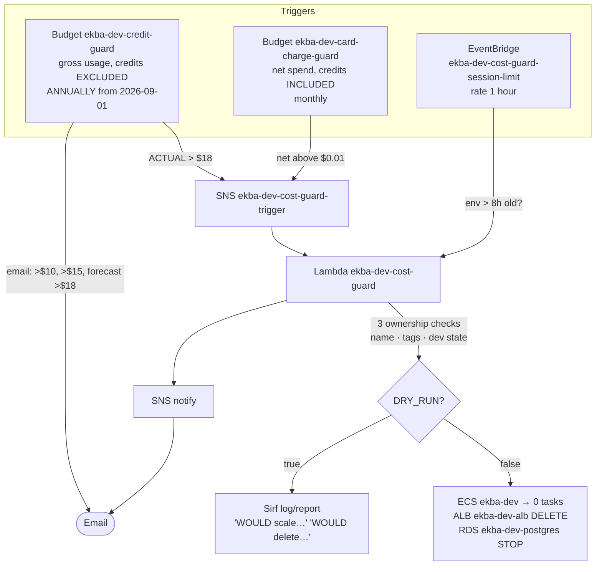

## 30.3 Thresholds

| Trigger | Threshold | Action |
|---|---|---|
| Gross usage (credits + refunds excluded), cumulative | > $10, > $15 | Email |
| Same | Forecast > $18 | Email |
| Same | **Actual > $18** | Email + **shutdown** |
| Net spend (credits ke baad = card charge), monthly | **> $0.01** | Email + **shutdown** |
| Hourly check | Environment 8 ghante se purana (ALB/service creation se, redeploy reset nahi karta) | **Shutdown** (dry-run mein sirf log) |

`deploy.sh` bhi **$18 gross** par deploy refuse karta hai (`COST_GUARD_SHUTDOWN_USD`, `COST_GUARD_START=2026-09-01`).

## 30.4 Shutdown kya karta hai / kya chhodta hai

**Karta:** ECS service `ekba-dev` → 0 tasks (delete nahi) · ALB `ekba-dev-alb` + listeners **delete** (ALB pause nahi hota; idle ALB ~$24/month).
**Chhodta:** VPC, subnets, SGs, target groups, cluster, task defs, IAM, logs, alarms ($0 idle — `destroy.sh` hatata hai) · poora baseline · frontend · state backend.
**Kabhi `terraform destroy` nahi chalata.**

**Safety:** har resource ke liye teen checks — naam `ekba-dev`/`ekba-dev-*`, tags `ProjectCode=ekba` + `Environment=dev` + `Lifecycle=ephemeral`, aur ARN `s3://ekba-tfstate-<ACCOUNT_ID>/dev/terraform.tfstate` mein. IAM role bhi sirf yahi do actions allow karta hai (policy simulator se verified).

## 30.5 DRY_RUN

- **Abhi: `true`** (live Lambda, committed example, local tfvars — teeno).
- Fail-safe: `false` ke alawa koi bhi value = dry run.
- Dry-run mein hourly check sirf log karta hai (email spam nahi); manual/budget trigger email bhejte hain.

**Arm karna (jab tum decide karo):**

```bash
# infra/terraform/envs/cost-guard/terraform.tfvars, line 22:  dry_run = false
cd infra/terraform/envs/cost-guard
terraform plan -out=tfplan      # expect: 0 to add, 1 to change, 0 to destroy (Lambda env)
terraform apply tfplan
cd ../../.. && ./scripts/cost-check.sh     # "kill switch … is ARMED"
```

<div class="callout warn" markdown="1">
Git push se ye apply **nahi** hota — `terraform.tfvars` git-ignored hai aur koi workflow cost-guard apply nahi karta. Arm karte hi agli hourly run 8 ghante se purana stack band kar degi. Demo chal raha ho to pehle `destroy.sh` + `deploy.sh` (fresh 8 ghante).
</div>

## 30.6 Manually verify

```bash
./scripts/cost-check.sh                               # gross / credits / net + ARMED ya DRY RUN
aws lambda invoke --function-name ekba-dev-cost-guard \
  --cli-binary-format raw-in-base64-out --payload '{"trigger":"manual"}' out.json && cat out.json
MSYS_NO_PATHCONV=1 aws logs tail /aws/lambda/ekba-dev-cost-guard --since 1h
```

Dry-run result (2026-09-12): `WOULD scale ECS service ekba-dev/ekba-dev from 1 to 0 tasks` · `WOULD delete load balancer ekba-dev-alb (and its listeners)` · `WOULD stop RDS instance ekba-dev-postgres (status available; data and storage kept)` · refused 0 · errors 0.

Shutdown ke baad: `./scripts/destroy.sh` → `./scripts/deploy.sh` → `./scripts/deploy-frontend.sh` (sirf `deploy.sh` service ko 0 par chhod dega kyunki Terraform `desired_count` ignore karta hai).

## 30.7 Kharcha — numbers

| Cheez | Cost |
|---|---|
| Backend stack chalte hue | ~$0.11/hour (Fargate ~$0.054, ALB ~$0.023 + LCU, 3 public IPv4 ~$0.015, RDS ~$0.019) → 4 ghante ~$0.44, mahina bhool gaye to ~$80 |
| RDS akela, 24/7 | ~$14/month ($11.68 instance + $2.30 storage) — isiliye session ke baad `destroy.sh` |
| Database snapshots (destroy ke beech) | ~$0.095 per GB per month — yahan kuch cents |
| Baseline idle | ~$1.70/month (4 secrets × $0.40) |
| Cost guard | ~$0 (free tiers) |
| Amplify | ~$0.04/build, idle ~$0 |
| CloudFront | demo traffic par ~$0 |
| Cost Explorer API | $0.01 per call (`deploy.sh`, `cost-check.sh`) |

Baseline budget `ekba-dev-monthly` ($20, 50/80/100%) credits **include** karta hai → credits khatam hone tak $0 dikhata hai. Asli protection upar wale gross/net budgets hain.

<div class="pagebreak"></div>

# 31. Manual Data Inspection (read-only)

<div class="callout warn" markdown="1">
Sab commands **read-only** hain. Secrets ki value kabhi print mat karo. AWS par RDS private subnets mein hai (SG sirf task SG se) aur Qdrant/Redis task ke andar hain (task SG sirf ALB se), ECS Exec off — wahan API aur logs use karo.
</div>

**S3**

```bash
aws s3 ls s3://<BUCKET>/ --recursive --human-readable | head        # AWS
# Local MinIO console: http://localhost:9001  (credentials .env mein)
```

**PostgreSQL (local)**

```bash
docker exec -it ekba-dev-postgres-1 psql -U ekba -d ekba
```

```sql
\dt
select tenant_id, status, count(*) from documents group by 1,2;
select document_id, status, progress, error_code from ingestion_jobs order by created_at desc limit 10;
select operation, model_used, input_tokens, output_tokens, estimated_cost, cache_hit
  from request_usage order by created_at desc limit 10;
select event_type, severity, reason, created_at from audit_events order by created_at desc limit 20;
```

**Qdrant (local)**

```bash
curl -s http://localhost:6333/collections/ekba_chunks            # points_count, config
curl -s -X POST http://localhost:6333/collections/ekba_chunks/points/scroll \
  -H 'Content-Type: application/json' \
  -d '{"limit":3,"with_payload":true,"with_vector":false,
       "filter":{"must":[{"key":"tenant_id","match":{"value":"seed-tenant-northwind"}}]}}'
# UI: http://localhost:6333/dashboard
```

**Redis (local)**

```bash
docker exec -it ekba-dev-redis-1 redis-cli --scan --pattern 'ekba:*' | head
docker exec -it ekba-dev-redis-1 redis-cli ttl <KEY>
```

**Cognito (AWS)**

```bash
aws cognito-idp list-users --user-pool-id "$POOL" --query 'Users[].[Username,UserStatus]' --output table
aws cognito-idp admin-get-user --user-pool-id "$POOL" --username <EMAIL> --query 'UserAttributes'
```

**ECS / CloudWatch (AWS)**

```bash
aws ecs describe-services --cluster ekba-dev --services ekba-dev --query 'services[0].events[:5].[createdAt,message]' --output text
MSYS_NO_PATHCONV=1 aws logs tail /ekba/dev/service --since 30m
```

**AWS par app data:** admin token se `GET /api/v1/admin/metrics`, `GET /api/v1/documents`, `GET /api/v1/admin/audit`.

<div class="pagebreak"></div>

# 32. Real End-to-End Example — "ABC Insurance"

<div class="callout info" markdown="1">
Ye story **currently supported** steps use karti hai. AWS par step 10 aur 20 abhi Bedrock quota (0) ki wajah se fail honge; local mode mein poora flow local AI stub ke saath chalta hai.
</div>

| # | Kya hota hai | Kaun/kahan |
|---|---|---|
| 0 | Pehla platform operator banao (poore system mein ek hi baar) | `./scripts/bootstrap-platform-admin.sh --email ops@…` |
| 1 | Operator login karta hai, pehle sign-in par apna password set karta hai | Frontend → `/auth/login` → `/auth/new-password` |
| 2 | **Companies → Onboard a company**: "ABC Insurance Private Limited", tenant id `abc-insurance` | `POST /api/v1/platform/tenants` |
| 3 | **Invite admin**: `admin@abc-insurance.example`. Cognito one-time password email karta hai — operator wo password kabhi nahi dekhta | `POST /platform/tenants/abc-insurance/admins` |
| 4 | Admin login karta hai, apna password set karta hai, apne users banata hai (HR / Finance / Legal) | `POST /api/v1/admin/users` |
| 5 | Documents page → "HR Maternity Policy.pdf" upload (dept `hr`) | `POST /api/v1/documents` |
| 6 | File S3: `tenant-abc-insurance/<uuid>.pdf` (SSE) | `storage.put_object` |
| 7 | Rows: `documents` pending, `ingestion_jobs` queued, audit `document.uploaded` | Postgres (AWS: RDS — ye rows task restart ke baad bhi rehti hain) |
| 8 | Background: text extract (pypdf, page numbers ke saath) | `extractors.extract_pdf` |
| 9 | Chunks (512 tokens, 64 overlap) + injection scan | `chunker`, `scan_content` |
| 10 | Embeddings (Titan v2, batch 25) | Bedrock |
| 11 | Qdrant upsert — har point par `tenant_id=tenant-abc-insurance` | `vector.upsert_chunks` |
| 12 | Document `ready`, `chunk_count` set, cache invalidate | Postgres (RDS), Redis |
| 13 | (Users step 4 mein hi ban gaye — admin ke Users page se) | `POST /api/v1/admin/users` |
| 14 | User email + password se login karta hai | Frontend → `/auth/login` |
| 15 | Sawaal: "Meri maternity leave policy kya hai?" | Chat page → `POST /api/v1/chat` |
| 16 | JWT verify → `tenant_id=tenant-abc-insurance`, role user | `core/auth.py` |
| 17 | Validation + injection scan + embed + cache lookup (ABC namespace) | pipeline stages 2–4 |
| 18 | Qdrant search **sirf ABC ke chunks** → threshold → rerank | stages 5–10 |
| 19 | Context envelope → Nova Lite | stages 8–9 |
| 20 | Citation validation + output guardrail + confidence | stages 11–12 |
| 21 | Usage + conversation save; answer (language of question) + `[S1]` → "HR Maternity Policy.pdf, page N" | `chat.py` |
| 22 | Frontend answer, citations, confidence, model, tokens, cost dikhata hai | `app/chat/page.tsx` |

**PLATFORM OPERATOR kar sakta:** companies banana, unka pehla admin invite karna, registry aur onboarding trail dekhna, company suspend/reactivate karna.
**ADMIN kar sakta:** apni company ke users invite/manage karna (role, department, deactivate, password reset), upload, tenant ka koi bhi document delete, chat, workflows, AI metrics, audit, security events.
**USER kar sakta:** upload, apna document delete, chat, workflows, feedback. Admin pages nahi.
**Koi nahi kar sakta:** doosre tenant ka data dekhna — na admin, na platform operator. Aur `platform_admin` role kisi bhi API se nahi mil sakta.

<div class="pagebreak"></div>

# 33. Complete Command Cheat Sheet

<div class="callout info" markdown="1">
Sab commands **repo root** (`D:\infy__masters`) se, Git Bash mein — jab tak `cd` na likha ho. `<…>` wali values apni daalo; secrets kabhi command line par mat likho.
</div>

**Local development**

| Kaam | Command |
|---|---|
| Ek-command setup | `./scripts/setup-local.sh` (PowerShell: `.\scripts\setup-local.ps1`) |
| Containers start | `docker compose --env-file .env -f infra/docker/docker-compose.yml up -d postgres qdrant redis minio minio-init` |
| Containers status | `docker compose --env-file .env -f infra/docker/docker-compose.yml ps` |
| Containers stop (data rahe) | `docker compose --env-file .env -f infra/docker/docker-compose.yml stop` |
| Containers + **data delete** | `… down -v` |
| venv activate | `cd backend && source .venv/Scripts/activate` |
| Migrations | `cd backend && alembic upgrade head` |
| Seed data | `cd backend && python -m seeds.seed` |
| Backend run | `cd backend && uvicorn app.main:app --reload --port 8000` |
| Frontend run | `cd frontend && npm run dev` |
| Login | Browser: seeded email + `.env` ka `DEV_AUTH_PASSWORD` |
| Dev token (user / admin / platform) | `cd backend && python -m seeds.dev_token` / `… --role admin --user seed-admin-a` / `… --role platform_admin` |
| Health | `curl localhost:8000/api/v1/health` · `curl localhost:8000/api/v1/health/ready` |

**Testing**

| Kaam | Command |
|---|---|
| Backend lint + format | `cd backend && ruff check . && ruff format --check .` |
| Backend sab tests | `cd backend && ENVIRONMENT=dev AI_PROVIDER=local DEV_AUTH_ENABLED=true pytest tests/unit tests/integration tests/security tests/evaluation -q` |
| Sirf security | `cd backend && pytest tests/security -q` |
| Onboarding journey | `cd backend && pytest tests/e2e -q` (PostgreSQL chahiye) |
| Frontend | `cd frontend && npm run lint && npm run typecheck && npm run build` (dev server band karke) |
| Cost-guard Lambda | `backend/.venv/Scripts/python.exe -m pytest infra/terraform/modules/cost-guard/lambda/tests -q` |

**AWS lifecycle**

| Kaam | Command |
|---|---|
| Kharcha + kya chal raha hai | `./scripts/cost-check.sh` |
| Pehla platform operator | `./scripts/bootstrap-platform-admin.sh --email ops@… [--dry-run]` |
| Backend deploy | `./scripts/deploy.sh` |
| Verify | `./scripts/verify.sh` |
| Seed (AWS) | `./scripts/seed.sh` |
| E2E | `./scripts/test-e2e.sh` |
| Backend rollback | CodeDeploy auto-rollback · ya `git revert <BAD_SHA>` + `./scripts/deploy.sh` (Chapter 22.5) |
| `rollback.sh` | Sirf verify + report — traffic shift implemented nahi |
| Frontend deploy / verify | `git push origin aws-deployment` · `./scripts/deploy-frontend.sh` |
| Frontend rollback | `./scripts/rollback-frontend.sh` (ya `--to <COMMIT_SHA>`) |
| **Destroy backend** | `./scripts/destroy.sh` → `DESTROY ekba-dev` |
| Identity check | `aws sts get-caller-identity --query Account --output text` |
| Mera IP | `curl -s https://checkip.amazonaws.com` |

**Diagnose (read-only)**

| Kaam | Command |
|---|---|
| ECS service | `aws ecs describe-services --cluster ekba-dev --services ekba-dev --query 'services[0].[status,runningCount,desiredCount]'` |
| ECS events | `aws ecs describe-services --cluster ekba-dev --services ekba-dev --query 'services[0].events[:5].[createdAt,message]' --output text` |
| Backend logs | `MSYS_NO_PATHCONV=1 aws logs tail /ekba/dev/service --since 30m` |
| Ek request trace | `MSYS_NO_PATHCONV=1 aws logs tail /ekba/dev/service --since 1h --filter-pattern '"<CORRELATION_ID>"'` |
| Target health | `aws elbv2 describe-target-health --target-group-arn <TG_ARN>` |
| CodeDeploy latest | `aws deploy list-deployments --application-name ekba-dev --deployment-group-name ekba-dev-dg --query 'deployments[0]' --output text` |
| CodeDeploy status | `aws deploy get-deployment --deployment-id <DEPLOYMENT_ID> --query 'deploymentInfo.[status,errorInformation]'` |
| Amplify jobs | `aws amplify list-jobs --app-id <APP_ID> --branch-name aws-deployment --query 'jobSummaries[:3].[jobId,status]'` |
| CloudFront → API | `curl -s https://<CLOUDFRONT_DOMAIN>/api/v1/health` |
| Cost-guard logs | `MSYS_NO_PATHCONV=1 aws logs tail /aws/lambda/ekba-dev-cost-guard --since 1h` |
| RDS status | `aws rds describe-db-instances --db-instance-identifier ekba-dev-postgres --query 'DBInstances[0].[DBInstanceStatus,PubliclyAccessible,StorageEncrypted]' --output text` |
| RDS snapshots | `aws rds describe-db-snapshots --db-instance-identifier ekba-dev-postgres --snapshot-type manual --query 'DBSnapshots[].[DBSnapshotIdentifier,Status]' --output text` |
| Database reachable? (task se) | `curl -s https://<CLOUDFRONT_DOMAIN>/api/v1/health/ready` — `postgres` component dekho |
| Terraform outputs | `cd infra/terraform/envs/<env> && terraform output` |

**Git**

| Kaam | Command |
|---|---|
| Status | `git status` |
| Kya badla | `git diff` / `git diff --cached --check` |
| Commit (files naam se) | `git add <files> && git commit -m "<message>"` |
| Frontend release | `git push origin aws-deployment` |
| Branch compare | `git rev-list --count origin/main..aws-deployment` |

<div class="pagebreak"></div>

# 34. Interview Preparation

## 34.1 Two-minute version

> "Maine ek **multi-tenant enterprise RAG platform** banaya hai. Companies apne documents — PDF, Word, Excel, images, audio — upload karti hain, aur employees natural language mein sawaal poochte hain; jawab **citations aur confidence score** ke saath aata hai.
>
> Backend **FastAPI** hai. Upload par file validate hoti hai (extension + magic bytes), S3 mein encrypted jaati hai, text extract hota hai, 512-token chunks bante hain, **Titan v2** se 1024-dim embeddings **Qdrant** mein jaati hain. Query par ek **14-stage pipeline** chalti hai: injection scan, semantic cache, tenant-filtered vector search, relevance threshold, BM25 rerank, **Amazon Nova** se answer, phir citation validation aur output guardrail.
>
> Sabse important cheez **tenant isolation** hai — `tenant_id` sirf verified **Cognito JWT** se aata hai aur har DB query, har Qdrant search, har cache key aur har S3 prefix mein lagta hai.
>
> AWS par **ECS Fargate** chalta hai, **CodeDeploy blue/green** ke saath auto-rollback; frontend **Amplify** par static export, API **CloudFront** ke through HTTPS. Sab **Terraform** mein — chaar states. Budget $20 tha, isliye ephemeral design: NAT aur ElastiCache nahi; Qdrant aur Redis containers hain, aur PostgreSQL ek chhota **RDS** (`db.t4g.micro`) jo stack ke saath hi banta-mitta hai — uska data snapshot ke through agle session mein wapas aa jaata hai. Ek **cost-guard Lambda** hai jo budget cross hone ya 8 ghante baad stack band kar sakta hai."

## 34.2 Five-minute version — structure

1. **Problem** (30 s): company knowledge scattered; generic chatbots hallucinate aur tenants ka data mix kar sakte hain.
2. **Architecture** (60 s): Browser → Amplify (static Next.js) · API → CloudFront → ALB → ECS task (api + qdrant + redis) → RDS PostgreSQL (private subnets), Bedrock, S3, Cognito, Transcribe.
3. **Ingestion** (45 s): validation, S3 key `<tenant>/<uuid>`, extractors, chunker, per-chunk injection scan (retrieval poisoning), batch embeddings, Qdrant with `tenant_id` payload index.
4. **RAG + guardrails** (75 s): 14 stages; context envelope (documents = data, not instructions); citations `[Sn]` validate; confidence formula; semantic cache per tenant (cosine ≥ 0.95); daily cost ceiling per user.
5. **Security** (45 s): JWT RS256 via JWKS; roles; rate limits; audit events; security headers; non-root container; secrets in Secrets Manager.
6. **DevOps** (45 s): Terraform 4 states; blue/green with 5xx alarm rollback; CI (lint, tests, gitleaks, Trivy, checkov, terraform validate).
7. **Honest limits** (30 s): Bedrock quota 0 is live par; relational data ab RDS mein bachta hai par Qdrant vectors abhi bhi task ke saath jaate hain; no self-service signup; hosted-UI login nahi; CI `main` par.

## 34.3 Likely questions — short answers

| Question | Answer |
|---|---|
| RAG kya hai? | Model ko sawaal ke saath relevant document chunks dena taaki jawab un par based ho, training data par nahi |
| Qdrant kyun? | Payload filtering (tenant) + open source + container mein chal jaata hai ($0) |
| Tenant isolation kaise? | Tenant token se; har layer (DB, Qdrant `must` filter, Redis key, S3 prefix) mein; cross-tenant attempt par critical audit; `tests/security` |
| Hallucination kaise kam? | Relevance threshold, "not found" refusal, citation validation, confidence score, strict prompt |
| Prompt injection? | Input scan (10 families), chunk scan at ingestion, envelope, output guardrail |
| Semantic cache? | Question embedding ka cosine ≥ 0.95 match same tenant mein; cache hit par bhi auth + guardrail |
| Blue/green? | Naya task set test listener (:8080) par; healthy hone par traffic shift; 5 minute rollback window; 5xx alarm par auto-rollback |
| Database kaunsa? | AWS par **RDS PostgreSQL** (`db.t4g.micro`, private, encrypted, password Secrets Manager se write-only argument ke through). Pehle sidecar container tha — data har task restart par chala jaata tha |
| Database sirf ek chhota instance kyun? | $20 ceiling. Single-AZ `db.t4g.micro` ~$14/month 24/7, isliye wo ephemeral stack ke saath hi rehta hai aur `destroy.sh` snapshot le leta hai. Production mein Multi-AZ + read replica + ElastiCache |
| Scale kaise? | Stateless API ke multiple tasks; managed DB/Qdrant Cloud; ingestion ko SQS worker mein nikalna |
| Biggest challenge? | CodeDeploy Free plan block; IP change par health fail; Amplify monorepo headers — har ek ka root cause dhoondha |
| Multi-tenancy kaise onboard hoti hai? | Teen-level hierarchy: `platform_admin` company banata hai aur uska pehla admin invite karta hai; wo admin sirf apni company ke users manage karta hai. Har level sirf apne se ek neeche wale ko bana sakta hai |
| Tenant admin ko platform admin banne se kaise roka? | Chaar layers: role schema mein hi valid value nahi (422), `TENANT_ASSIGNABLE_ROLES` mein nahi, server-side `assert_role_assignable` refuse karta hai, aur token verify par platform role sirf `platform` tenant ke saath valid hai. Koi API platform role de hi nahi sakti |
| Platform admin tenant isolation ko tod nahi deta? | Nahi — wo apne reserved `platform` tenant mein rehta hai (jisme content nahi hai), aur uska ekmatra cross-tenant access `control_plane.py` hai: sirf registry data (naam, id, seat counts), koi document/chat/metric nahi, aur har mutation audited |
| Password kaise handle karte ho? | Karte hi nahi. Cognito one-time password email karta hai, user pehle sign-in par apna set karta hai. App password set/store/log/return kabhi nahi karta, aur task role ke paas `AdminSetUserPassword` hi nahi hai |
| Login ko brute force se kaise bachaya? | Per-account 10 attempts/min (IP par nahi — CloudFront ke peeche IP shared ya client-supplied hoti hai), generic failure message, aur forgot-password hamesha 202 |
| Kya improve karoge? | SES se branded invitation emails, MFA (pool `OFF` par hai), SCIM/SSO se bulk user provisioning, SQS ingestion worker, WAF + custom domain, `main`-based CI/CD |

<div class="callout warn" markdown="1">
Interview mein **wahi bolo jo implemented hai**. "Async workers (separate queue)", "LangSmith tracing", "Cognito hosted UI", "MFA" — ye abhi **implemented nahi** hain; poochha jaye to "planned" bolo. Login, refresh, aur tenant/user admin APIs **implemented hain**.
</div>

<div class="pagebreak"></div>

# 35. NEVER DO THIS

<div class="callout danger" markdown="1">
**In mein se koi bhi galti data leak, kharcha ya toota hua deploy de sakti hai.**

1. **Secrets commit mat karo** — `.env`, `*.tfvars`, `*.tfstate`, `tfplan`, `backend.hcl`, keys, tokens.
2. **`git add .` mat karo** — `docs/reports/2026*.md` (account ID + live URLs) andar aa jaati hain. Files naam se add karo.
3. **`terraform destroy` seedha mat chalao** — sirf `./scripts/destroy.sh`.
4. **Baseline / cost-guard / frontend / state backend destroy mat karo** — secrets, ECR images, Cognito users, budget, URLs sab jayenge.
5. **Destroy/replace wala plan bina samjhe apply mat karo** — khaaskar Amplify app replace (naya URL, GitHub reconnect).
6. **`dry_run = false` bina soche mat karo** — agli hourly run 8 ghante purana stack band karegi.
7. **AWS Budget ko hard cap mat samjho.**
8. **Frontend se `tenant_id` bhejne wala endpoint mat banao** — tenant sirf JWT se.
9. **User ka `custom:tenant_id` galti se mat badlo** — wo user doosri company ka data dekhne lagega.
10. **Guardrail stage skip mat karo** "speed ke liye", aur test delete karke build green mat karo.
11. **`NEXT_PUBLIC_*` mein secret mat daalo** — browser mein sab public hai.
12. **Real JWT online decoder mein paste mat karo.**
13. **ECS ko haath se scale / console se edit mat karo** — Terraform drift; ALB ka kharcha chalta rehta hai.
14. **Dev server chalte hue `npm run build` mat chalao.**
15. **`docker compose down -v` bina soche mat chalao** — local DB, Qdrant, MinIO data delete.
16. **Embedding model badal kar same Qdrant collection use mat karo** — nayi collection + re-index.
17. **Stack chalu chhod kar mat jao** — session ke end mein `./scripts/destroy.sh`.
18. **Kisi aur project ke AWS resources ko touch mat karo** — ownership = state + `ekba-*` naam + `ProjectCode=ekba` tag.
</div>

<div class="pagebreak"></div>

# 36. Glossary

| Term | Simple matlab (is project mein) |
|---|---|
| **RAG** | Retrieval-Augmented Generation — pehle documents se relevant hisse dhoondo, phir model unke basis par jawab de |
| **LLM** | Large Language Model — yahan Amazon Nova Lite / Micro |
| **Embedding** | Text ka number-vector (1024 numbers, Titan v2) — similar meaning = paas-paas vectors |
| **Vector DB** | Vectors store + similarity search — yahan Qdrant |
| **Chunk** | Document ka chhota tukda (~512 tokens) jo embed hota hai |
| **Token** | Text ki unit (~4 characters); model ka kharcha tokens par |
| **Cosine similarity** | Do vectors kitne same direction mein — 1 = same meaning |
| **Rerank** | Vector results ko dobara order karna (yahan BM25 lexical mix) |
| **Semantic cache** | Milte-julte sawaal ka pichla jawab reuse (same tenant) |
| **Tenant** | Ek company; uska data baaki se alag |
| **JWT** | Signed token jisme user ki claims (tenant, role) hoti hain |
| **ID token vs access token** | Cognito ke do token; backend ko **ID token** chahiye (usme `aud` + custom claims) |
| **JWKS** | Cognito ki public keys jinse token signature verify hota hai |
| **Cognito** | AWS user directory + login |
| **Guardrail** | Safety check stage (input, retrieval, output) |
| **Prompt injection** | Text jo model ko instructions badalne ke liye bahkaaye |
| **Citation `[Sn]`** | Jawab ka woh hissa kis source chunk se aaya |
| **ECS / Fargate** | AWS container service / bina server manage kiye containers |
| **Task definition** | Container recipe (image, CPU, memory, env, secrets) |
| **ALB** | Application Load Balancer — traffic ko healthy tasks par bhejta |
| **Target group** | ALB ke peeche tasks ki list (blue / green) |
| **CodeDeploy blue/green** | Naya version saath mein chalao, check karo, traffic shift karo |
| **CloudFront** | AWS CDN — yahan API ko HTTPS dene ke liye |
| **Amplify** | Static frontend hosting + GitHub se auto-build |
| **Static export** | Next.js ko plain HTML/JS files mein build karna (`NEXT_OUTPUT_MODE=export`) |
| **CORS** | Browser rule — kaunsi website API call kar sakti hai |
| **Terraform state** | Terraform ki yaaddasht — kaunsa resource usne banaya |
| **Plan / apply** | Kya badlega dikhana / sach mein badalna |
| **Drift** | Asli AWS aur Terraform state mein farak (haath se change karne se) |
| **Ephemeral** | Temporary — destroy + recreate by design |
| **DRY_RUN** | Cost guard sirf batata hai, kuch band nahi karta |
| **Correlation ID** | Ek request ka unique ID, har log line mein |
| **Alembic** | Database schema migrations tool |
| **Idempotent** | Dobara chalane par same result, koi nuksaan nahi |

<div class="pagebreak"></div>

# 37. Final Quick Reference

<div class="quickref" markdown="1">

| Cheez | Value |
|---|---|
| **Frontend (live)** | `https://aws-deployment.d39pgpamq0p0n8.amplifyapp.com` |
| **API (live, jab backend deployed ho)** | `https://d2jw2wchz5oekh.cloudfront.net/api/v1` |
| **Local** | Frontend `http://localhost:3000` · API `http://localhost:8000` · Docs `/docs` · Qdrant `:6333/dashboard` · MinIO `:9001` |
| **Region / states** | `us-west-2` · baseline, cost-guard, dev, frontend |
| **Release branch** | `aws-deployment` (Amplify) · CI `main` par |
| **Login** | Email + password (dono jagah). Local password: `.env` ka `DEV_AUTH_PASSWORD` |
| **Token** | Cognito **ID token**, `/auth/login` se — frontend khud manage karta hai. Debug ke liye `python -m seeds.dev_token` (local only) |
| **Pehla operator** | `./scripts/bootstrap-platform-admin.sh --email …` (iski koi API nahi hai) |
| **Cost guard** | `DRY_RUN=true` · $18 gross shutdown · card > $0.01 · 8 ghante |

**Roz ka flow**

```bash
./scripts/cost-check.sh           # 1. kya chal raha hai, kitna kharcha
./scripts/deploy.sh               # 2. backend up (commit ke baad)
./scripts/deploy-frontend.sh      # 3. frontend wiring verify (12 checks)
# 4. demo
./scripts/destroy.sh              # 5. session khatam — DESTROY ekba-dev
```

**Problem aaye to — pehle ye 5**

1. `./scripts/cost-check.sh` — stack chal bhi raha hai?
2. `curl -s https://checkip.amazonaws.com` vs `allowed_cidrs` — IP badla?
3. `MSYS_NO_PATHCONV=1 aws logs tail /ekba/dev/service --since 30m`
4. ECS service events (`describe-services … events[:5]`)
5. Amplify job logs / CodeDeploy lifecycle events

**Files jo sabse zyada kaam aayengi**

`backend/app/services/rag/pipeline.py` (RAG) · `backend/app/core/auth.py` (login) · `backend/app/core/config.py` (settings) · `frontend/src/lib/api.ts` (API client) · `infra/terraform/envs/dev/terraform.tfvars` (IP, sizing) · `infra/terraform/envs/cost-guard/terraform.tfvars` (DRY_RUN) · `RUNBOOK.md` · `scripts/`

</div>

**Mujhe ye karna hai — kaunsa chapter?**

| Kaam | Chapter | Kaam | Chapter |
|---|---|---|---|
| Project local start | 18 | Backend change / deploy | 20.1 / 19.2 |
| Company onboard karna | 7.3 | Logs dekhna | 27 |
| Users banana / use karna | 7, 6 | Login / password troubleshoot | 28.2 (Auth) |
| Role hierarchy samajhna | 2.2, 8.1 | API troubleshoot | 28.2 |
| Document add karna | 12, 32 | Cognito / ID token | 6.6, 28.2 |
| Data kahan jaata hai | 17 | Qdrant troubleshoot | 15, 28.2 |
| Sawaal poochna | 13.1, 32 | Frontend / backend stop | 18.5, 22, 22.5 |
| RAG flow samajhna | 13 | AWS band karna | 22 |
| Data inspect karna | 31 | Redeploy | 22.4 |
| Frontend change | 20.2 | Rollback | 22.5 |
| Frontend deploy | 19.1, 22.2 | Safe destroy | 22.3, 24.3 |
| AWS kharcha | 30 | Interview | 34 |

<div class="callout ok" markdown="1">
**Yaad rakho:** Local = $0, sab kuch pehle local mein. AWS = demo ke liye, aur **demo ke baad `destroy.sh`**.
</div>
